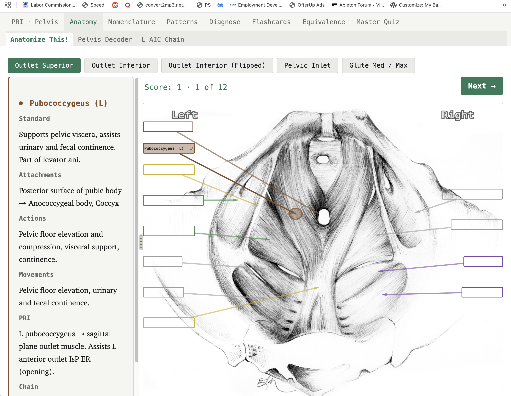
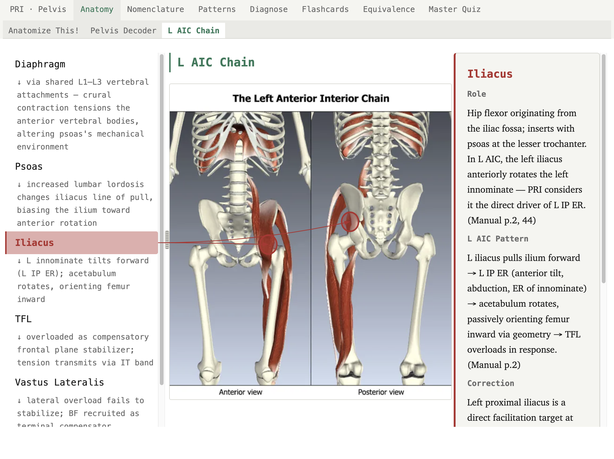
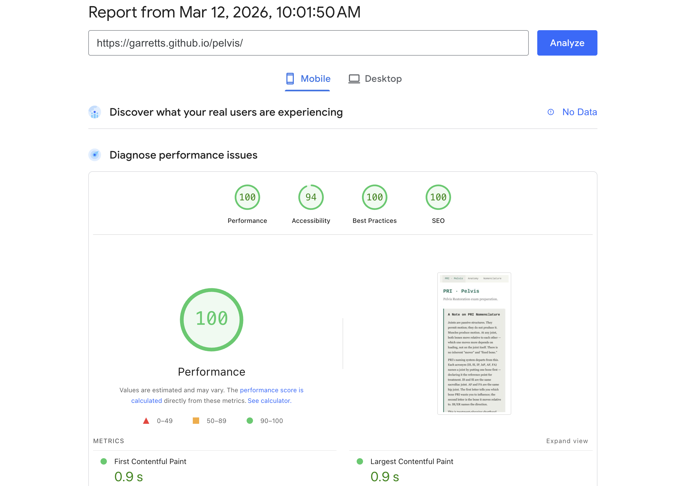

# PRI · Pelvis

Interactive study app for the PRI Pelvis Restoration certification exam. Vanilla JS, zero dependencies, zero network requests after load. Deployed at [garretts.github.io/pelvis](https://garretts.github.io/pelvis).

## What it does

Seven interactive modules covering the Pelvis Restoration curriculum: anatomy identification with clickable hotspot overlays, PRI-to-standard nomenclature translation, pattern diagnosis scenarios, flashcards, equivalence chain walkthrough, and a 175-question master quiz with spaced repetition.

The app treats PRI's manual as a primary source — not a catechism. Where PRI terminology departs from standard anatomy, the app flags the departure and explains the underlying mechanics. Where the manual's claims are idiosyncratic, the data says so and cites the source. The `aic-chain.json` separates anatomical fact from PRI interpretation at the field level.





## Why no framework

No React, no build step, no bundler, no `package.json`. This is a deliberate constraint, not a limitation.

Zero dependencies means every failure mode is the author's to handle. There is no framework lifecycle to defer to and no black-box error boundary to swallow exceptions. This is the load-bearing connection to the project's fail-safe principle: every `catch` block must answer "what does the user see?" — because there is nothing else in the stack to answer it.

The code guidelines document ([code-guidelines.md](.doctrine/code-guidelines.md)) codifies this and the rest of the engineering standards. It is opinionated and worth reading on its own.

## Built with Claude Code

This project uses [Claude Code](https://docs.anthropic.com/en/docs/claude-code) (Anthropic's CLI agent). The workflow resembles XP-style pairing — I drive, Claude Code proposes. All design decisions, code review, and editorial direction are mine. Every line Claude Code produces is individually reviewed and edited before commit. As part of this process, the code guidelines are honed to catch anti-patterns and improve the production of high-quality, performant code.

[CLAUDE.md](CLAUDE.md) is the behavioral contract that constrains Claude Code's output. [code-guidelines.md](.doctrine/code-guidelines.md) defines the engineering standards it must follow. [bin/pre-commit-check.sh](bin/pre-commit-check.sh) mechanically catches the violations it can grep for. The rules it cannot grep for — module cohesion, fail-safe completeness, silent-failure detection — require Claude Code to re-read the guidelines before every commit (Step 1 of the pre-commit sequence).

These rules were not written in advance. They were tightened iteratively, each one a response to a specific failure mode observed during development:

- **Explicit Asset Lists.** Claude Code added a stale JSON file to the service worker precache manifest by including everything in `data/`. The file was unused by app code — it was a development artifact. A dev-tool HTML file referenced an image that also ended up in precache, passing the orphan check because the script counted dev-tool references as valid. Both produced pointless 404 requests in production. The fix was a new principle in [code-guidelines.md](.doctrine/code-guidelines.md): "each entry must be individually justified by an *app* code reference... Dev tools and PRD documents are not app code; a reference from a dev tool does not justify inclusion in an asset list."

- **Failure paths require approval.** Claude Code's default behavior when writing a `fetch` call is to add a `catch` block with `console.error` and move on. That passes a mechanical check for "has a catch block" but fails the actual requirement: the user sees nothing. The rule in CLAUDE.md now requires it to stop and present the failure scenario before writing the handler: "State what operation can fail, what the consequence is, and list contextual handling options."

- **Fail-safe self-review.** After the failure-path rule was added, Claude Code found ways to satisfy the letter while missing the spirit — returning `null` from a failed operation, which pushed the failure downstream. The verification standard was added: "for every `catch` block and error path in the diff, answer: *what does the user see?* If the answer is 'nothing' — the code returns null, logs to console, or swallows the error — it is not handled."

The commit history tells this story. Rules emerged from failures, not from upfront design.

## Architecture

```
index.html
sw.js                     — service worker (cache-first, offline support)
css/
  layout.css              — structure, grid, responsive breakpoints
  landing.css             — home tab
  anatomize.css           — anatomy ID game
  aic-chain.css           — L AIC chain diagram
  decoder.css             — SVG pelvis schematic, equivalence quiz
  diagnose.css            — clinical scenarios, case studies
  flashcards.css          — flashcard deck
  masterquiz.css          — master quiz
  nomenclature.css        — joints, translation table
  patterns.css            — cheat sheet, concept map, test reference
scripts/
  navigation-tabs.js      — hash routing, tab/subtab activation
  anatomize.js            — anatomy ID game (hotspots, polygon overlays)
  nomenclature.js         — PRI ↔ standard translation
  patterns.js             — pattern comparison, symptom matching
  diagnose.js             — clinical scenarios, case studies, causal chains
  flashcards.js           — deck with spaced repetition
  equivalence.js          — chain walkthrough
  equivalence-quiz.js     — equivalence chain quiz mode
  masterquiz.js           — 175-question bank, session config
  aic-chain.js            — L AIC chain interactive diagram
  decoder.js              — SVG pelvis schematic
  abbreviations.js        — abbreviation reference
  fetch-feedback.js       — user-visible fetch error handling
  study-data-cache.js     — shared data loader with caching
  resize-handle.js        — draggable split-pane resize
data/
  aic-chain.json          — chain data: anatomy separated from PRI interpretation
  anatomize-data.json     — 6 image sets, 56 structures, hotspot coordinates
  master-quiz.json        — question bank with explanations
  flashcard-deck.json     — 69 cards, categorized by exam weight
  study-data.json         — nomenclature, terminology, causal maps
  (+ 8 additional data files)
img/
```

Modules are ES modules (`type="module"`). No globals except a shared data cache. Event delegation throughout — no inline handlers, no `querySelectorAll` loops for state changes. Active Object pattern for tab/selection state.

## Code standards

[Google JS](https://google.github.io/styleguide/jsguide.html)/[CSS](https://google.github.io/styleguide/htmlcssguide.html)/[HTML](https://google.github.io/styleguide/htmlcssguide.html) style guides as baseline, extended with project-specific rules:

- **Fail-safe as a first-class principle.** Every failure case handled explicitly. `return null`, `console.error`, and `throw` are the same anti-pattern — all silent failures that delegate the problem to the user's blank screen.
- **Module naming by domain concept.** No `utils.js`, `helpers.js`, `tools.js`. If a module cannot be named after what it does, it does not have a single responsibility.
- **Active Object for exclusive state.** Hold a reference to the active element. Deactivate it directly on switch. Never scan siblings.
- **Event delegation over per-element listeners.** Attach to ancestors, match via `closest()`.
- **Dead code removal after every change.** Orphaned selectors, unreferenced IDs, stale variables — cleaned on commit, not accumulated.

Full standards: [code-guidelines.md](.doctrine/code-guidelines.md)

## Run locally

```bash
git clone https://github.com/GarrettS/pelvis.git
cd pelvis
python3 -m http.server 8000
```

Open [http://localhost:8000](http://localhost:8000). No install, no build.

## Performance



*March 2026*
