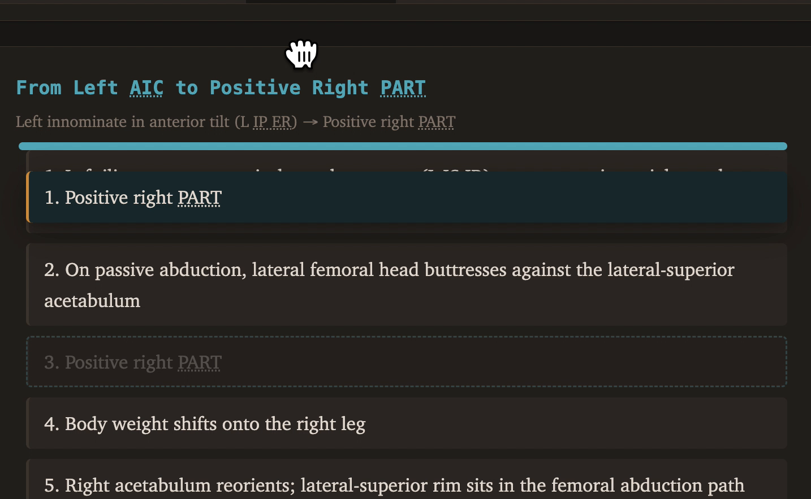

# Diagnose Causal Chains

  Design, code, and article by [Garrett Smith](https://github.com/GarrettS)
  [Live demo](https://garretts.github.io/pelvis/#diagnose/causal-chains)
  [Source: `sortable-list-form.js`](../../scripts/sortable-list-form.js)

## Contents

- [Introduction](#introduction)
- [The Game and Constraints](#the-game-and-constraints)
- [Construction and Identity](#construction-and-identity)
- [Dragging](#dragging)
- [Resolving the Drag](#resolving-the-drag)
- [Grading and Feedback](#grading-and-feedback)
- [Reshuffle](#reshuffle)
- [Page-Load Entrance](#page-load-entrance)
- [State Classes](#state-classes)
- [Reference](#reference)

## Introduction

This is a top-down code walkthrough of Diagnose Causal Chains that explains how the code is built and why. 

The exercise drills physiological cause-and-effect. Each chain is a sequence of steps — a flattened diaphragm causes pelvic dysfunction — presented scrambled inside its own form. The learner drags the steps into the correct order, checks the result, and reshuffles to try again.

This article and the code it explains are organized by *purpose*. Features map to design decisions that work with platform capabilities, and are implemented with engineering design principles. Use-cases drive the abstractions that motivate the architecture. The work reasons from first principles — breaking each problem into its fundamentals, building from *how* and *why* it works. This departs sharply from learning by rote, copying others, and stopping at *what* without asking *how* or *why*. Creating without understanding produces fragility. 

The cost is skill and effort — to learn the web platform and apply software engineering principles; to engineer rather than reach for prefabrications, and the patience and diligence to use it well. The payoffs are better code and self-improvement. 

**For the code:** user stories map to architecture built on the web platform rather than generalized abstraction libraries. The resulting code is lean (~600 lines of commented javascript; no dependency floor), clean, coherent, easy to debug and refactor, and efficient.

**For the craftsman:** the problem-solving and platform mechanics in the codebase explained below train whoever follows along, not copiers.

Those who value precision over vibes, comprehension over turnkey boilerplate, and code quality over software labor will enjoy this article. This is work. To build rather than assemble requires an investment of patience, discipline, and diligence. 

## The Game and Constraints

Each *chain* is a stepwise list of the progression of biomechanical pathology from initial cause to diagnosis.

The program needs to render these as ordered-but-scrambled numerical lists with each list inside its own form with a start-to-end summary, and each step showing its current ordinal index. Then the user can drag the steps into what he thinks the correct sequence is, click **"Check Order"** to grade it, and click "Reshuffle" to restart the game with a new random order.

### The Drag

- Drag a clone of the pressed item.
- Show an insertion bar where it will land.
- Update the clone's ordinal to the position it would take.
- Reorder the list to that sequence on drop.
- Settle the clone back to its slot when the drop changes nothing, or the drag is cancelled.
- Keep every slot reachable while dragging.

### Constraints

- `pointermove` drag with no layout thrashing.
- Repeated Reshuffle or dragging-and-dropping in quick succession can't corrupt the order or strand a half-finished animation.
- Accurate drop targeting while the page scrolls, and autoscroll, so the user can reach the drop targets within the *scrollport*.
- Pointer and touch, including addressing and filtering out multi-touch input.
- Grading that survives a re-drag without showing colors for an order the user has since changed.

## Construction and Identity

The constructor for SortableListContainer requires a few things, including a builder function. The builder function allows implementations to customize, and it passes parameters that must be included in the template that it returns. 

### Form and List Creation

To start, the JSON entries must be mapped to list items. Those can go inside a FORM to capture `submit` events for Check Results and Reshuffle. 

Each chain id is the JSON key:

```json
{
  "diaphragm-to-adt": {
    "title": "From Diaphragm to Positive ADT",
    "start": "Left hemidiaphragm loses ZOA (no liver support)",
    "end": "Positive left ADT",
    "steps": [
      "Left diaphragm flattens, becomes postural instead of respiratory",
      "Left psoas shortens (shares anterior lumbar attachments with crura); iliacus joins the pull",
      "Left innominate pulled into anterior tilt (IP ER: flexion, abduction, ER)",
// ...
    ]
  },
```

Each `steps[i]` maps to an LI. The user-sorted order needs to be compared against the correct order. For that, each item will need some kind of an id. The JSON doesn't carry that, so the chain-unique step text can be used for that. 

Step names can contain whitespace and quotation marks, so they can't become `id` without sanitization, but a custom `data-step` can give `checkResults` something on the LI to compare against the ordered values.

To check results and reshuffle, the list is inside a FORM with two buttons, `checkResults` and `reshuffle`. When the user clicks "**Check Order**", `onsubmit` dispatches to `checkResults` which compares each LI's `data-step` against the stored data and marks it with a className of `"correct"` or `"incorrect"`.

#### Generated HTML

```html
<form name="diaphragm-to-adt">
  <div class="sortable-list-parent">
    <ol class="sortable-list" id="diaphragm-to-adt">
      <li data-step="Positive left ADT">Positive left ADT</li>
      <li data-step="Left acetabulum rotates forward over the femur (AF ER)">Left acetabulum rotates forward over the femur (AF ER)</li>
      <li data-step="Left innominate pulled into anterior tilt (IP ER: flexion, abduction, ER)">Left innominate pulled into anterior tilt (IP ER: flexion, abduction, ER)</li>
      <!-- ... -->
    </ol>
  <div class="sortable-list-dropbar" aria-hidden="true"></div>
  </div>
  <div class="btn-row">
    <button name="checkResults" class="primary">Check Order</button>
    <button name="reshuffle">Reshuffle</button>
  </div>
</form>
```

The *clone* is an absolutely-positioned `<ol>` that gets appended as a sibling to the `.sortable-list`. Both share a containing block, so when it's time to drag, the clone can be positioned over the original in the same coordinate space.  (See [The Drag Clone](#the-drag-clone)). 

### SortableListContainer

`SortableListContainer` wraps the container element.  During construction, it creates a [`SortableListForm`](#sortablelistform) instance for every definition, registers delegated event listeners on `el`, and replaces `el`'s contents with the generated form elements.

```js
constructor(el, {
  definitions,
  getSteps = list => list.steps,
  renderFormHTML,
  renderItemHTML = escapeHTML,
  flipDuration = 200} = {})
```

Each Container event handler checks `event.target` and climbs the DOM to find the list or form, gets that list or form's ID, then gets the corresponding instance via `SortableListForm.getById(elementId)` (see [Shared Key](#the-shared-key)):

```js
const sourceItem = e.target.closest('.sortable-list > li');
if (!sourceItem) return;
const ol = sourceItem.parentNode;
const activeForm = SortableListForm.getById(ol.id);
```

Shared Key Event Delegation Path:

```
                                  ┌─container element's delegated listeners
       pointer/submit             ▼
READ: <li>/<button> ─bubbles─► container el ─► closest() ─► (ol.id || form.name)─┐
                                                                                 │
RESOLVE:        instance ◄─ #instances[id] ◄─ SortableListForm.getById(id)◄──────┘
```

The container element holds `SortableListForm` and handles its delegated listeners. These are registered once at construction; every list's events bubble.

The container, the delegated listeners, and the Shared Key are one decision viewed three ways. Construction stamps the id — the JSON key — onto `form.name`, `ol.id`, and the `#instances` registry, so the same string identifies a chain as data, as DOM, and as a cached instance. One delegated listener set on `SortableListContainer`'s `el` catches events for every form, and, because the touched element can get the id, `SortableListForm.getById` returns the decorator instance in one call. The id is the Shared Key, in all three places at once.

### SortableListForm

Class `SortableListForm` manages the state and DOM subtree for its associated form, list, and other elements. The SortableListForm instantiation is performed *automatically* from the `SortableListContainer` constructor. For every definition passed to its constructor, the `SortableListContainer` creates a `SortableListForm`.

#### Factory-Gated Construction

Symbol-gated `SortableListForm.getById` factory method gets or creates the instance that *decorates* the form.

```js
static getById(id, definition, container) {
  return SortableListForm.#instances[id] ??= SortableListForm.#create(id, definition, container);
}
```

This method runs the constructor, which builds the detached `<form>` and calls its container's `renderFormHTML` and `renderItemHTML`. Subsequent calls bypass construction and return the cached instance by `id`. The factory is called by `SortableListContainer`, which accepts a list of definitions for the instances.

The delegated event handlers do not need to pass their `definition` to `SortableListForm.getById(id)` at this point, as the instance has already been created, so the definition can be discarded and GC'd. All the program needs is the steps:

```js
const steps = container.getSteps(definition);   // ordered, via the injected hook
this.#steps = Object.freeze([...steps]);        // the answer key, kept frozen
```

##### Instantiation and Inversion of Control

The `definition` argument is the per-chain data object from the JSON value shown above. One renderer function, `renderFormHTML(definition)` must be supplied by the implementation.

`SortableListForm` and `SortableListContainer` are tightly coupled so implementation code can define its own app-specific rendering with renderer functions that produce markup specific to the chain, like a title heading `<h3 class="form-title">${expandAbbr(title)}</h3>`, the start-to-end summary, and the steps with their abbreviations expanded. `SortableListForm` shuffles the steps, then calls `container.renderFormHTML(definition)`, then `container.renderItemHTML(step)`, to build (and later re-build) the items. (These hooks and their defaults are in [Container Options](#container-options).)

#### The Button-Name Contract

Function [`renderFormHTML`](#sortablelistform) must emit submit buttons whose `name` values match the public `SortableListForm` methods (see [submit dispatch](#submit-dispatch)).

#### Submit Dispatch

To handle form submission, submit dispatch uses two keys: `e.target.name` for `SortableListForm.getById(e.target.name)` to find the instance, and `e.submitter.name`, the activated button's `name`, mapped to the instance method.

```js
#onSubmit = e => !e.preventDefault() && SortableListForm.getById(e.target.name)[e.submitter.name]();
```

`<button name="checkResults">` is mapped to `form.checkResults()` and `<button name="reshuffle">` to `form.reshuffle()` — the button `name` *is* the method name. Nothing whitelists the call; the only constraint is `renderFormHTML`, which emits just those two buttons, so those are the only names that reach the lookup.

#### Item Identity

Each sortable `<li>` carries its order-identifiable step, a string value. That value must be compared against the ordered steps supplied during construction. So it's necessary to compare the item's string value, which needs to be placed in the DOM, or associated with the item. The `id` attribute can't contain whitespace, so the text can't go there, and item content gets replaced with `renderItemHTML`, so that can't be relied upon. That leaves one of two choices: either put step text in a custom attribute or create a per-chain stamp order (`diaphragm-to-adt-0`, `diaphragm-to-adt-1`, etc.).

##### Cheating

Numerically representing step order in the HTML means grading collapses to "are the id suffixes ascending", which is easy to check programmatically, but leaks the answer into the HTML for cheating, making the widget a lot less reusable. So instead, `SortableListForm` gives each LI a `data-step`, so order can be checked less obviously.

```text
container.getSteps(list) → step text
          ├─► data-step on the <li>   (identity in the DOM)
          └─► #steps / #currentOrder  (set at construction; compared in grading)
```

The data-step can then be used to rebuild the HTML.

#### The Shared Key

Each instance sets its id `form.name` and `ol.id` at construction — so a chain's identity is one string, reused across four spots and three realms (here, `"diaphragm-to-adt"`):

| Spot             | Realm                          | Set by                    | Read by                                |
| ---------------- | ------------------------------ | ------------------------- | -------------------------------------- |
| JSON key         | data                           | the data file             | source — stamped onto the rest         |
| `form.name`      | DOM                            | constructor               | submit handler (`e.target.name`)       |
| `ol.id`          | DOM                            | constructor               | pointer handlers (`closest()`→`ol.id`) |
| `#instances` key | registry of `SortableListForm` | `getById` `??=`, 1st call | every later `getById(id)`              |

Each step carries its own key — its text in `data-step` — read by the drag and grading code.

### Initialization

```js
function initSortableLists(chainDefinitions) {
  new SortableListContainer(chainsWrap, {
    definitions: chainDefinitions,
    getSteps: chain => chain.steps,
    renderFormHTML: renderChainForm,
    renderItemHTML: expandAbbr,
    flipDuration: parseFloat(
      getComputedStyle(document.documentElement).getPropertyValue('--dur-normal'))
  });
}
```

### Conclusion

The Container instantiates the Forms and manages event delegation — one listener set for *N* Forms. Each `SortableListForm` manages its own state and geometry (baseline, clone, dropbar) driven by coordinates. The Container holds the `#activeForm` ([Web XP](https://github.com/GarrettS/web-xp)'s **Active Object** pattern); its listeners guard on it — is a drag active? is this its pointer? — then delegate to that Form's methods (`dragStart`, `dragMove`, `dragDrop`, `dragCancel`), passing the event's coordinates.

___

## Dragging

Dragging moves a *clone* of the pressed item. The *source item* stays. Dragging the item itself would cause a layout change, so a clone gets created with `position:  absolute`, taking it out of normal flow, so the list won't reflow. To show a drop insertion preview, the clone's number (*ordinal index*) updates as the drop target shifts and an insertion bar shows where it'd land, if dropped at that point. The original item stays put, dimmed and in flow, until dragging is complete, either by the clone being dropped on an item in a different slot or dragging canceled.

Dragging requires reading geometry to separate reads from writes, building a clone, and wiring events `pointerdown`, `pointermove`, and `pointerup` to update where the drop would land and manage the dragging lifecycle. Measurements, core to dragging, cut across the `document`, `window`, elements, and `event` objects.

### The Coordinate Models

Various measurements off various objects are needed. Their values move relative to their systems. There is not one flexible coordinate system for the developer. Coordinates come from multiple sources: `event`, `window`, and elements, and measure in the following spaces:

1. **`event.clientY` — *viewport space***: pixels relative to the top-left corner of the visible browser window (the viewport). This space is entirely agnostic to scrolling.
2. **`event.pageY` — *page space***: pixels relative to the top-left corner of the page; the document canvas.
3. **`window.scrollY`** — **viewport's** current scroll position; the distance between page top and viewport top in number of pixels measuring the document scroll. Alias for `window.pageYOffset`.

`event.pageY === event.clientY + window.scrollY` ([desync probe test](../../manual-tests/native-desync-probe.html)). The individual `pageY` summands, `clientY` and  `window.scrollY`, are, however, needed for [*autoscroll*](#autoscroll), where a dwelling pointer fires no event.

*Relative* measurements can be calculated by subtracting **BCRs (Bounding Client Rects)** to compare *element* layout size and position coordinates. The dragged object and target positions are calculated this way, as explained in [Containing-Block Offsets](#containing-block-offsets).

These brittle systems can be reconciled to handle dragging needs by using deltas. 

#### Synthesis and Strategy

The clone's position is the sum of where it starts from (the sourceItem), and how much it moves by (the delta). Relative element positions from BCR subtraction position the clone to source element. Relative pointer positions adjust that position by the measured delta in `event.pageY` on pointermove. This is covered in [Drag Move](#drag-move).

#### Containing-Block Offsets

No property produces *containing-block space*, the distance between an element and its containing block. MSIE `offsetTop` was *intended* to, but rounds to integer, measures from an "`offsetParent`", and may or may not include parent border width, depending on the browser version, so it's not reliable.

But `getBoundingClientRect()` provides reliable *viewport-relative* pixel values that, when used under constraints, can be translated into *containing block space*, with the following formula: 

```js
const difference = childRect.top - parentRect.top;
```

That subtraction works when the parent has `border: 0`: the padding edge then coincides with the border-box top `getBoundingClientRect()` reports. A top border would sit between them.

This is relevant because the y-distance from `sourceItem` to its parent list's content edge must be measured. But the clone is an `<ol>`, and `<ol><ol>` is invalid, so the list and the clone are both appended to a relatively-positioned parent, .sortable-list-parent. Zeroing margin, border, and padding on the parent and the lists sets all their edges flush.

##### HTML Structure

```
  div.sortable-list-parent ← position: relative containing block
  ├── ol.sortable-list
  │   ├── li
  │   ├── li
  │   └── li.active-drag-source
  └── ol.sortable-list-clone  ← position: absolute over the list
      └── li
```

##### Zeroing CSS

```css
.sortable-list-parent,
.sortable-list,
.sortable-list-clone {
/* Align the parent's border box with the list's content box, to translate
viewport-relative values into containing block offsets with: 
const cloneTop = sourceRect.top - listParentRect.top;
*/
  margin: 0;
  border: 0;
  padding: 0;
}
```

- **list margin/border/padding zeroed** match the list's content box to the parent's — the drop-target rects, read from the items, fall in the frame.
- **parent border zeroed** match the parent's border box to the list's border box, so `listParentRect.top` (a border-box `getBoundingClientRect` read) is the parent's top: the value `cloneTop` calculates from.
- **parent padding zeroed** match list's top edge (in flow) to the top of the parent, the absolutely positioned clone's top reference point.
- **clone margin/border/padding zeroed** match the clone's box to the list's, so the cloned `<li>` overlays the original.

```
┌─ ol.sortable-list ──────────┐ ← listRect.top == listParentRect.top
|  item 1                     |
│  item 2                     │
│  item 3 ▓▓ GRABBED ▓▓▓      │ ← sourceRect.top ◀────── clone anchors here
│  item 4                     │
└── div.sortable-list-parent ─┘ ← listParentRect.bottom == listRect.bottom
```

[^offsetTop]: was [miscodified](https://lists.w3.org/Archives/Public/www-style/2008Apr/0464.html) c2008 across multiple 2008 W3C redrafts punishing Microsoft and breaking the web. It changed reference edge from offsetParent's border edge to padding edge and back again, twice; against IE's shipped behavior each time. No property that gives the offset reliably emerged (call-outs [0364](https://lists.w3.org/Archives/Public/www-style/2008Apr/0364.html), [0440](https://lists.w3.org/Archives/Public/www-style/2008Apr/0440.html)).

### Setting Up an Unbreakable Drag Session

Single-pointer dragging must reject secondary touches and context-menu clicks, and allow dragging on only one list at a time. The program does not have control over the user's device or input methods, and so must guard against the user breaking it. 

#### The Pointerdown Gates

The `SortableListContainer`  manages event delegation for the SortableListForm instances. Its `pointerdown` handler needs to selectively guard against several things to prevent program corruption. These sequential gates are: *pointer validity*, *drag ownership*, and *target validity*.

**`SortableListContainer` Instance `pointerdown` Handler**

```js
#onPointerDown = e => {
  if (!e.isPrimary // only allow primary pointer events.  
        || e.button !== 0 // filter out context-button clicks.
        || e.ctrlKey // ctrlKey triggers context-menu; don't start dragging
        || this.#activeForm // the form being dragged within.
  ) return;

  const sourceItem = e.target.closest('.sortable-list > li');
  if (!sourceItem) return;

  const ol = sourceItem.parentNode;
  if (ol.ariaDisabled === 'true') return;

  this.#activeForm = SortableListForm.getById(ol.id);

  // Pressing on an LI is drag intent, never selection-initiation.
  // Selection started outside an LI can still extend through it.
  e.preventDefault();

  this.#activePointerId = e.pointerId;
  this.#activeForm.dragStart(sourceItem, e.pageY);
  this.#el.ownerDocument.documentElement.classList.add('list-drag-active');
  this.#startTracking();
};
```

For any non-primary event, the function exits. But `isPrimary` does not prevent additional pointer streams. Finger, stylus, and mouse can all be primary. Rather than trying to handle dragging more than one item at once, it's easier to gate that by bailing if a drag is in progress.

`SortableListContainer` sets `#activeForm`  so the other session-scoped event handlers, and also this function, can check if one exists, such as to handle `pointercancel` , etc. The list's `id` matches that of its `SortableListForm` cached decorator, obtained using `SortableListForm.getById(ol.id)`.

More than one pointer (fingers, mouse, stylus) can be down at once. Each gets its own `pointerId` and event stream. The drag handles just the first, identified by its `pointerId`. The handlers must act on that pointer only, so `#activePointerId` records it and all handlers guard on it, so no other pointer (thumb) can interfere with dragging. Primary mouse or pen pointer and primary touch pointer may be active at once. **`isPrimary`** rejects any non-primary pointer from *starting* a drag when *none* are running.

```js
this.#activePointerId = e.pointerId;
```

After passing the initial gate, the next check is to see if the user clicked on a draggable item, and if none is found, exit:

```js
const sourceItem = e.target.closest('.sortable-list > li');
if (!sourceItem) return;
```

Calling `preventDefault()` makes text selections fail on root while drag is in process — part of a multi-pronged text-selection-suppression approach explained in [Preventing Text Selection](#preventing-text-selection).

After passing the gates, Container's pointerdown handler commits to building the drag session, gathering baseline geometry and adding the clone in `dragStart`, then adding an `AbortController`-managed group of drag-session-scoped event listeners in `#startTracking`.

### Capturing the Pointer 

Dragging requires tracking the pointer past the list, and past the viewport edge (autoscroll needs pointermove to keep arriving there), so it must continue to receive pointermove off-window. But by default, each pointer event is dispatched to whatever is under the pointer. This means that when the pointer leaves the `<li>`, the pointer events go elsewhere.

Element method `setPointerCapture` seems the obvious reach. It is designed to reroute the event stream directly to the element it's called on, regardless of what the pointer is currently over, even off-window, for the lifecycle of that event until capture is released (e.g. `pointerup` fires; the event is canceled, etc). But Chromium intermittently clears capture before the terminating pointerup dispatches, so it's unreliable: [524131116: lostpointercapture sometimes fires before pointerup; pointerup retargets away from capturing element](https://issues.chromium.org/issues/524131116). 

Pointermove fires off-window for touch events and wherever else buttons == 1 (depressed mouse button), so the stream keeps arriving.  Off-window delivery without capture: [offwindow.html](../../manual-tests/no-capture-offwindow.html).

So avoiding setPointerCapture, the move and release listeners bind to `document`. The pointer leaves the grabbed source `<li>` during the drag, so `pointerup` fires wherever the pointer rests at release — or, off-window, on the document root. Keyed on `pointerId`, the listeners act only for the tracked pointer; one `AbortController`, aborted in `#stopTracking`, drops the set at once.

```js
#startTracking() {
  const {signal} = this.#dragListeners = new AbortController();
  const doc = this.#el.ownerDocument;
  const win = doc.defaultView;
  doc.addEventListener('pointermove', this.#onPointerMove, {signal});

  // Capture phase, so a descendant stopPropagation can't ghost the drag.
  doc.addEventListener('pointerup', this.#onPointerUp, {capture: true, signal});
  doc.addEventListener('pointercancel', this.#onPointerCancel, {capture: true, signal});
  doc.addEventListener('keydown', this.#onKeyDown, {capture: true, signal});

  // Resize stales the frozen baseline; blur or a hidden tab can swallow the
  // pointerup. All abort.
  win.addEventListener('resize', this.#abortDrag, {signal});
  win.addEventListener('blur', this.#abortDrag, {signal});
  doc.addEventListener('visibilitychange', () => doc.hidden && this.#abortDrag(), {signal});
}
```

`AbortController` is a browser API that tags and groups fetch requests and event listeners, so they can be cancelled later. When that signal is passed to `addEventListener()`, the listener is automatically removed when `controller.abort()` is called. This lets the program group event listeners by signal, so they can be removed by calling `abort`. This is more convenient than cancelling all of the listeners, which requires the same target, event type, listener function, and capture/options used at registration. Instead, it reduces to `#dragListeners.abort()`.

All the drag-ending callbacks (*enders*) are registered to fire in the *capturing phase*. The capturing listeners on `document` fire on the way down, before these events can reach any descendant, so any descendant handler calling `stopPropagation()` would be too late to stop the event from reaching the ender (already fired).

Without that, the user might get stuck with a ghost drag (button up; pointer released; event didn't reach the ender; element glued to the pointer — broken state). With capturing, the drag ends regardless of what handlers below do with propagation.

Method `#startTracking` returns to the Container's pointerdown handler, which also called `dragStart`.

Dragging begins with `dragStart`, which picks up responsibility for all measurements and DOM changes needed for the rest of the drag.

### Drag Start

After the [pointerdown gates](#the-pointerdown-gates) have determined a sourceItem and [started tracking](#capturing-the-pointer), `dragStart` runs, first calling `#captureDragBaseline` to measure the geometry the rest of the drag reads, then `#commitDragDOM` to establish a *drag session*.

Method `#captureDragBaseline` returns a frozen snapshot of measurements for DOM-free math during dragging. This includes an array of `slots` for the list items, the clone's constrained travel bounds, and the scrollport. The scrollport is the scroll container's padding box — its visual viewport.

Method `#commitDragDOM` appends the clone that persists through the session, dims the source, and returns the *drag session*.

```js
dragStart(sourceItem, grabStartY) {
  const baseline = SortableListForm.#captureDragBaseline(sourceItem, grabStartY);
  const session = SortableListForm.#commitDragDOM(baseline);
  this.#dragSession = session;
  // Park the bar at the source's resting slot -- the gap just after it -- so the first
  // reveal glides from the source's own edge, not from a stale spot a slot away.
  this.#dropbarEl.style.setProperty('--dropbar-position', session.currentSlot.dropbarTop + 'px');
  this.#autoscroll = this.#createAutoscroll(baseline);
}
```

The closing line builds the drag's autoscroll, covered in [Autoscroll](#autoscroll).

#### Capturing the Drag Baseline

Interleaving layout reads (`getBoundingClientRect`) with layout-invalidating writes (style updates, DOM mutations) forces the browser layout engine to recompute layout repeatedly, a CPU-intensive operation that hogs memory and can noticeably impact dragging experience.

Pointermove is a hot path. The drag needs stable drop target positions and clamp bounds to compare against pointer position without re-measuring the list on every frame.

Therefore, `#captureDragBaseline` (below) reads every needed measurement *before* the drag moves and captures them as an immutable baseline for `dragStart`.

```js
static #captureDragBaseline(sourceItem, grabStartY) {
  const listEl = sourceItem.parentNode;
  const listParent = listEl.parentElement;
  const items = [...listEl.children];
  const sourceRect = sourceItem.getBoundingClientRect();
  const listRect = listEl.getBoundingClientRect();
  const listParentRect = listParent.getBoundingClientRect();
  const doc = sourceItem.ownerDocument;
  const win = doc.defaultView;
  const scrollport = SortableListForm.#captureScrollport(doc);

  // The clone is a same-size copy of sourceItem, built later in #commitDragDOM,
  // so its geometry matches the source's. cloneTop reads relative to listParent
  // -- the clone's containing block -- so its CSS top lands it over the source.
  const cloneTop = sourceRect.top - listParentRect.top;

  return Object.freeze({
    listEl,
    listParent,
    sourceItem,
    items,
    cloneTop,
    // Dragged item's page-Y edges at grab, for the autoscroll's clone-visibility check.
    sourceItemY: sourceRect.top + win.scrollY,
    sourceItemYBottom: sourceRect.bottom + win.scrollY,
    ordinalValue: items.indexOf(sourceItem) + 1,
    scrollport,
    dragRange: Object.freeze({
      grabStartY,
      ...SortableListForm.#getDragRange(sourceRect, listRect, items)
    }),
    slots: SortableListForm.#measureSlots(
      items, sourceItem, listRect.top, listRect.height)
  });
}
```

  - `cloneTop` — the clone's pixel `top`, aligned with the grabbed item → [Positioning the Clone](#positioning-the-clone)
  - `ordinalValue` — the grabbed item's 1-based display number → [Clone Number Rebinding](#clone-number-rebinding)
  - `dragRange` — `grabStartY` and the clone's `minDelta`/`maxDelta` travel bounds — a first-pass peek from `#getDragRange` (see [Constraining the Drag](#constraining-the-drag))
  - `slots` — one per item plus an end-of-list slot, each with a hit-test midpoint (`midpointY`), bar position (`dropbarTop`), `ordinal`, and `isDropTarget`; the source and the slot after it are non-targets → [Target Resolution](#target-resolution), [The Dropbar](#the-dropbar), [Clone Number Rebinding](#clone-number-rebinding)
  - `scrollport` — the visible band the target's edge clamp and the autoscroll check both measure against → [Target Resolution](#target-resolution), [Autoscroll](#autoscroll)
  - `sourceItemY` / `sourceItemYBottom` — the grabbed item's page-Y edges at grab, for autoscroll clone-visibility check → [Autoscroll](#autoscroll)

#### Measuring the Slots

`slots` is the one baseline measurement large enough to warrant its own function. `#measureSlots` builds it the way the rest of the baseline is built — read once at pickup, stored in page coordinates so a mid-drag scroll can't stale it. Two details are specific to slots. Each item's top comes from its `getBoundingClientRect`, then its in-flight transform is subtracted (`settledViewTop = box.top - animOffsetTop`).

```js
// Measure each item into a drop slot, plus a trailing end-of-list null slot. Subtract
// in-flight transform from the BCR top so a mid-FLIP pickup lands on the resting slot.
// midpointY (page coords) hit-tests the pointer; dropbarTop (list frame) places the 
// bar.
static #measureSlots(items, sourceItem, listViewTop, listHeight) {
  const win = sourceItem.ownerDocument.defaultView;
  const scroll = win.scrollY;
  const afterSource = sourceItem.nextElementSibling;
  const isDropTarget = item => item !== sourceItem && item !== afterSource;
  const slots = new Array(items.length + 1);
  items.forEach((li, index) => {
    const box = li.getBoundingClientRect();
    const transform = win.getComputedStyle(li).transform;
    // Subtract the `translateY`, which `DOMMatrix` exposes as `.f`.
    const animOffsetTop = transform === 'none' ? 0 : new win.DOMMatrix(transform).f;
    const settledViewTop = box.top - animOffsetTop;
    slots[index] = {
      item: li,
      midpointY: settledViewTop + box.height / 2 + scroll,
      dropbarTop: settledViewTop - listViewTop,
      ordinal: index + 1,
      isDropTarget: isDropTarget(li)
    };
  });

  slots[items.length] = {
    item: null,
    // Infinity catches any pointer past the last item, so #slotInScrollport always returns a slot.
    midpointY: Infinity,
    dropbarTop: listHeight,
    ordinal: items.length + 1,
    isDropTarget: isDropTarget(null)
  };
  return slots;
}
```

##### Subtracting the Animation

There are a few transitions, primarily the drop settling, where items shift to reorder. Any item grabbed mid-flight must be measured from its resting place, subtracting the transform. Both `midpointY` (the pointer's hit-test threshold) and `dropbarTop` (the item's top in the list frame) start from the item's box top with any `translateY` subtracted, read by: `animOffsetTop = transform === 'none' ? 0 : new win.DOMMatrix(transform).f;` In CSS Matrix, `f` maps to the `translateY` arg: `matrix(a, b, c, d, tx, ty)` (see: [DOMMatrix API](https://developer.mozilla.org/en-US/docs/Web/CSS/Reference/Values/transform-function/matrix)).

```
matrix(a, b, c, d, e, f)
matrix(1, 0, 0, 1, 0, n)
       ↑        ↑     ↑
   keep x   keep y   ty (the f/m42 position)
```

Three names for the `translateY` component:

 `ty`   — MDN's CSS matrix() parameter (translate-Y)
 `f`   — the letter form (SVG's matrix, DOMMatrix's .f property)
 `m42`  — DOMMatrix's grid-index property

With that geometry frozen, dragStart's second half — `#commitDragDOM` — turns it into what the user sees: the floating clone, and the dimmed original it lifts away from.

#### The `#dragSession` Object

The `#dragSession` wraps the frozen baseline with session-scoped properties updated during the drag.

```js
static #commitDragDOM(baseline) {
  const { listParent, sourceItem, ordinalValue, cloneTop } = baseline;

  listParent.querySelector('.sortable-list-clone')?.remove();
  const clone = listParent.appendChild(newEl('ol', {
    className: 'sortable-list-clone',
    attrs: {start: ordinalValue, 'aria-hidden': 'true', style: `top: ${cloneTop}px`},
    children: [sourceItem.cloneNode(true)]
  }));
  // active-drag-source dims the picked-up LI; the :has(> li.active-drag-source) rule
  // uses it to suppress the now-stale grading until the drop resolves -- a no-op or
  // abort re-shows that grading, a reorder clears it.
  sourceItem.classList.add('active-drag-source');

  return {
    // Reassigned in dragMove as the pointer crosses slot midpoints.
    currentSlot: baseline.slots[ordinalValue],
    clone,
    baseline
  };
}
```

  `#commitDragDOM` returns the **drag session**:

  - **`currentSlot`** — the drop slot under the pointer; starts at the home slot (the source's next sibling), reassigned in `dragMove` → [Target Resolution](#target-resolution)
  - **`clone`** — the lifted `<ol>` the drag moves; removed on drop → [Moving the Clone](#moving-the-clone)
  - **`baseline`** — the frozen geometry from `#captureDragBaseline`.

From here to the drop, `dragMove` reads only numbers, from the session and `session.baseline`. Reading numbers never queries layout, so any write during the drag — the clone renumber, or whatever else this or other code dirties — costs `dragMove` no reflow.

### Drag Move

[Capturing the Drag Baseline](#capturing-the-drag-baseline) froze the list's geometry at pickup — the read half of the read/write split. `dragMove` is the write half. Called on pointermove, its job is to move the clone by the pointer, highlighting drop targets, and then apply autoscroll (which gates and bails when not needed).

```js
dragMove(pageY, clientY) {
  this.#autoscroll.update(clientY, this.#applyDragPosition(pageY, clientY));
}
```

Method `#applyDragPosition()` moves the clone by the pointer and highlights drop targets, and serves as a reentry point for a second caller, autoscroll's rAF.  

#### Moving the Clone

Method `#applyDragPosition` updates the clone's position, then hands off to `#updateInsertionPoint` which positions the dropbar where the item will be inserted if dropped and updates the clone's *ordinal*.

```js
// Shared by dragMove (pointer events) and the autoscroll loop.
#applyDragPosition(pageY, clientY) {
  const deltaY = this.#getConstrainedDeltaY(pageY);
  this.#dragSession.clone.style.setProperty('--drag-offset', deltaY + 'px');
  this.#updateInsertionPoint(clientY);
  return deltaY;
}
```

Method `#applyDragPosition` writes the clamped delta to `--drag-offset`, applied by CSS as: `translateY(var(--drag-offset))`, so `dragMove` writes one number per frame and CSS does thrash-free GPU positioning. 

Method `#updateInsertionPoint` uses the same strategy to update `--dropbar-position`. That's covered in more depth under [Target Resolution](#target-resolution).

```css
.sortable-list-clone {
  position: absolute;
  z-index: calc(var(--lift-z) + 1);
  /* The clone is never an interaction target.
   But, its WAAPI animation outlives list-drag-active during the settle glide, 
   so drag-wide pointer-events rule does not cover its whole lifetime. */
  pointer-events: none;
  transform: translateY(var(--drag-offset, 0px));
}
```

The calculated distance is the difference between `pageY` — where the cursor is now — and  `grabStartY` — where it was when the drag started. The value of `deltaY` is *clamped* to the list's bounds, and the value written to a custom css property, `--drag-offset`. The `#getConstrainedDeltaY` clamping will be explained in [Constraining the Drag](#constraining-the-drag).

Each move writes the clone offset from `pageY` and runs the autoscroll edge check on `clientY`.

___

#### Target Resolution

Each move resolves the pointer to a drop position, or ***slot***. The easiest way to understand the concept of slots is to observe the dropbar insertion while dragging.

The slots, measured in `#measureSlots`, called from `#captureDragBaseline` capture insertion points (see [read/write split](#capturing-the-drag-baseline)). Here is the slot signature.

```js
slots[index] = {
  item: li,
  midpointY: settledViewTop + box.height / 2 + scroll,
  dropbarTop: settledViewTop - listViewTop,
  ordinal: index + 1,
  isDropTarget: isDropTarget(li)
};
```
There is one special case, the end-of-list Null Object slot, a slot with `midpointY: Infinity`, so a pointer past the last item's midpoint resolves to that final slot, the drop-at-the-end position, with a `null` `item` for `insertBefore`.

```js
slots[items.length] = {
  item: null,
  // Infinity catches any pointer past the last item, so #slotInScrollport always returns a slot.
  midpointY: Infinity,
  dropbarTop: listHeight,
  ordinal: items.length + 1,
  isDropTarget: isDropTarget(null)
};
```

Each slot also has an `ordinal`, its list item display number, and `item`, the element itself, where the item gets inserted if dropped in its hit-test zone — `listEl.insertBefore(sourceItem, slot.item)`. Updating the ordinal is trivial, and insertion will be covered in [Dropping](#dropping).

The `midpointY` property is used in a strategy to sequentially iterate through items in source order, asking on each iteration ***"is the pointer's `pageY` above this item's midpoint?"***, (`pageY <= midpointY`) — and when the result of that test is true, the loop exits. 

```js
#slotInScrollport(clientY) {
  const { baseline } = this.#dragSession;
  const { top, bottom } = baseline.scrollport;
  const pageY = Math.max(top, Math.min(bottom, clientY)) + this.#container.win.scrollY;
  return baseline.slots.find(({ midpointY }) => pageY <= midpointY);
}
```

When the session's `currentSlot` changes, the dropbar position and clone number are updated.

```js
// Resolve the slot under the pointer; on a change, move the dropbar to the new
// insertion point and renumber the clone.
#updateInsertionPoint(clientY) {
  const foundSlot = this.#slotInScrollport(clientY);
  if (foundSlot === this.#dragSession.currentSlot) return;
  this.#dragSession.currentSlot = foundSlot;
  this.#updateDropbar();
  this.#updateCloneNumber();
}
```

To accommodate edge scrolling ([autoscroll](#autoscroll)), `#slotInScrollport` highlights only the droptargets inside the scrollport.

##### The Case Against `elementFromPoint`

Calling `elementFromPoint` on `pointermove` for the hit-test, plus a `getBoundingClientRect` on the matched item to choose insert-before vs insert-after breaks the read-write boundary, impacting performance (Test: [Target resolution: elementFromPoint vs frozen numbers](../../manual-tests/target-resolution-reflow.html)).

Moreover, `elementFromPoint` returns an *element* from a cursor point, but the program needs to know if the pointer is *above* that element's midpoint, so the midpoint would still need to be checked, so it's not just a tradeoff between simplicity and performance.

| approach                | layout clean | layout dirty |
| :---------------------- | -----------: | -----------: |
| elementFromPoint + gBCR |     130.8 ms |    2302.6 ms |
| frozen numbers          |       0.2 ms |       0.5 ms |

The frozen baseline keeps `pointermove` write-only, measuring every position once at pickup so the hot path never reflows. 

#### The Dropbar

The dropbar is a thin bar that marks where the dragged item will land. It tracks the cursor but "snaps" to each slot to indicate where the item would be inserted.

The dropbar, like the clone, gets built, then appended to `.sortable-list-parent`. But unlike the clone, its content never varies, so unlike the clone it is reused across drags. CSS `translateY` is applied to an element that tracks the cursor, but, unlike the clone, the element is hidden by default, shown when the drop would move something, and never destroyed. Like the clone's `--drag-offset`, it's a JS-written  property applied as `translateY` (`--dropbar-position`), so it moves by composite with no layout.

Like `#applyDragPosition`, `#updateDropbar` sets a property for a CSS transform `--dropbar-position`, so it updates with no layout change.

```js
#updateDropbar() {
  const { currentSlot } = this.#dragSession;
  this.#dropbarEl.style.setProperty('--dropbar-opacity', +currentSlot.isDropTarget);
  this.#dropbarEl.classList.add('dropbar-gliding');
  this.#dropbarEl.style.setProperty('--dropbar-position', currentSlot.dropbarTop + 'px');
}
```

Unlike the draggable clone, the dropbar shows on every *mutating* insertion point. 

Class `dropbar-gliding` enables the `transform` transition, so `--dropbar-position` takes `slot.dropbarTop`, making it appear to glide to each position it lands, including the hidden non-mutating positions.

The source's own slot and the slot after it don't change list order, so `slot.isDropTarget` is `false` there and `opacity` transitions to `0`. 

```css
.sortable-list-dropbar {
  transform: translateY(var(--dropbar-position, 0px));
  transition: opacity var(--dur-fast) ease-out;   /* fades on every show/hide */
...
```

When dragging is finished, these styles get cleaned up:

```js
#endSession() {
  this.#dropbarEl.classList.remove('dropbar-gliding');
  this.#dropbarEl.style.setProperty('--dropbar-opacity', '0');
...
```

___

### The Drag Clone

The clone is an `<ol>` with one same-sized copy of the `sourceItem`. It's absolutely-positioned and appended to the `div.sortable-list-parent` as a sibling of the `sortable-list` in `#commitDragDOM` (in pointerdown).

The drag baseline's `cloneTop` positions the clone over the `sourceItem` item.



```html
<div class="sortable-list-parent">
  <ol class="sortable-list" id="diaphragm-to-adt">
    <li data-step="Positive left ADT">Positive left ADT</li>
    <li data-step="Left acetabulum rotates forward over the femur (AF ER)">Left acetabulum rotates forward over the femur (AF ER)</li>
    <li data-step="Left innominate pulled into anterior tilt (IP ER: flexion, abduction, ER)">Left innominate pulled into anterior tilt (IP ER: flexion, abduction, ER)</li>
    <!-- ... -->
  </ol>
  <div class="sortable-list-dropbar" aria-hidden="true"></div>
  <!-- clone gets dynamically appended here:  -->

  <ol class="sortable-list-clone" start="2" aria-hidden="true" 
      style="top: 48px; --drag-offset: 106.1px;">
    <li 
      data-step="Femur is biomechanically oriented inward by the acetabular fossa" 
      class="">Femur is biomechanically oriented inward by the acetabular fossa</li>
  </ol>
</div>
```

#### Clone OL Attributes

  - `class="sortable-list-clone"` — the floating copy; styled `position: absolute; pointer-events: none`.
  - `start="2"` — ordinalValue, the grabbed item's 1-based slot; makes the single-item `<ol>` display the
    right number.
  - `aria-hidden="true"` — it's a visual duplicate; keep it out of the accessibility tree.
  - `style="top: nn"` — cloneTop (`sourceRect.top` - `listParentRect.top`), positioning the clone over the sourceItem at pickup.
  - `--drag-offset` — set per-frame by `dragMove`; the CSS transform that makes the clone follow the pointer (added on the first move).

The original `<li>` carries class="active-drag-source" (added after the clone is copied, so the clone doesn't inherit it) — that's what dims it and, via `:has(> li.active-drag-source)`, suppresses stale grading until the drop resolves.

#### Styling the Clone

The clone needs `position: absolute` to position it above the sortable list with `z-index`, but this makes it *shrink-to-fit*, so a clone with a single line of text shrinks to the text line's width. In contrast, the sortable-list is in *normal flow*.

The trick is to make *both* lists' items *grow-to-fill* inside a  *shrink-to-fit* container.

```css
.sortable-list-parent {
  /* Stretch to the intrinsic width — the longest single line of contained text. */
  width: max-content;
  /* Constrain this width to the containing block. */
  max-width: 100%;
}
```

With the container's width constrained, block-level text-wrapping behavior takes effect, so text wraps to the next line.

The `.sortable-list-clone` must be `width: 100%` to fill the wrapper.

```css
.sortable-list,
.sortable-list-clone {
  list-style: decimal inside;
  width: 100%;
}
```

Now *all* `<li>` elements fill their container, so every item grows to the one shared `width: min(longest_unwrapped_item, available_width)`.

Equal width gives equal wrapping, and with all other dimensions matched, the clone's item matches the source item's height — an invariant `cloneHeight` depends on.

#### Positioning the Clone

The clone's rendered position comes from two places: `style.top` and CSS transform. `style.top` is set once at `dragStart` to `cloneTop`. The `transform` moves it per pointer-move via `--drag-offset` (0 at grab), as shown in [Drag Move](#drag-move) so the drag triggers no per-frame layout.

#### Clone Number Rebinding

To show the numerical order that would be applied when the item is dropped, the clone's `start` gets assigned the number from the current `slot` it's over. That number is the slot's precomputed `ordinal`, and for the end slot, it's `items.length + 1` ([Measuring the Slots](#measuring-the-slots)).

```js
#updateCloneNumber() {
  const { clone, currentSlot, baseline: { ordinalValue } } = this.#dragSession;
  clone.start = ordinalValue < currentSlot.ordinal ? currentSlot.ordinal - 1 : currentSlot.ordinal;
}
```

The ternary accounts for self-displacement. Dragging *up*, **item 4** dropped before **item 3** gets ordinal **3** — the slot's own. But when dragging *down* the list, if dropping **item 2** before **item 4**, **item 3** shifts up to fill **slot 2**, and the dropped item is inserted in **slot 3**.

___

### Constraining the Drag

Dragging is constrained to the list with an algorithm that uses two boundaries. With list edges as the clone's constraining outer bound, the clone obscures the first and last item drop targets, as shown below.


An alternative to constraining the clone to the list is to use a *peek* formula where:

* **Min =** Clone's *bottom* edge, `EDGE_PEEK` px *above* the *first* item's *bottom* edge
* **Max =**  Clone *top* edge, `EDGE_PEEK` px *below* *last* item's *top* edge

But this edge peek strategy has a different problem — **Underclamp**. When an edge item is taller than the clone, the peek holds the clone short of the list's own edge, so it never reaches it.



The clamp that lets the clone travel furthest toward the edge uses both clamp formulas. At each end, the clamp allows whichever bound is more distal — min() at the top, max() at the bottom:

- **Container Bound (Flush)**: the list box.

- **Target Bound (`EDGE_PEEK`)**: ensure drop zones visible.

This *soft-edge-with-peek* calculation called by `#captureDragBaseline`:

```js
static #getDragRange(sourceRect, listRect, items) {
  const cloneHeight         = sourceRect.height;
  const firstItemViewBottom = items[0].getBoundingClientRect().bottom;
  const lastItemViewTop     = items.at(-1).getBoundingClientRect().top;

  const clonePeekViewTop     = firstItemViewBottom - cloneHeight - EDGE_PEEK;
  const clonePeekViewBottom  = lastItemViewTop + EDGE_PEEK;
  const cloneFlushViewTop    = listRect.top;
  const cloneFlushViewBottom = listRect.bottom - cloneHeight;
  const minCloneViewTop = Math.min(clonePeekViewTop, cloneFlushViewTop);
  const maxCloneViewTop = Math.max(clonePeekViewBottom, cloneFlushViewBottom);
  return {
    minDelta: minCloneViewTop - sourceRect.top,
    maxDelta: maxCloneViewTop - sourceRect.top
  };
}
```

This *soft-edge-with-peek* algorithm lets the clone reach the list's edge, and `EDGE_PEEK` lets it escape the edge only when needed to reveal the edge items. This clamped range is pre-calculated before dragging, for use in `pointermove`.

Each `dragMove` passes `pageY` to `#getConstrainedDeltaY`,  which returns a  `dragRange`-clamped `deltaY`:—

```js
#getConstrainedDeltaY(pageY) {
  const { grabStartY, minDelta, maxDelta } = this.#dragSession.baseline.dragRange;
  return Math.max(minDelta, Math.min(maxDelta, pageY - grabStartY));
}
```

— matching the desired min/max boundaries that `dragMove` writes to `--drag-offset`.

Clamped this way, the clone reaches either edge of the list with each edge item's drop target still visible. That covers every slot. A chain taller than the window leaves its far slots outside the scrollport, reachable only if the page scrolls to follow the clone.

### Autoscroll

While the pointer is at the scrollport edge, and the clone hasn't reached its end of travel, the program should scroll the window and move the clone so the user can reach the potential drop targets. 

The clone has to stay in view as it follows the pointer, so keeping it shown in the scrollport requires some form of proximity check:

- **Element Proximity** — scroll the *element* into view when it broaches the scrollport edge.
- **PointerProximity** — scroll the *viewport* when the *pointer* touches the viewport's proximity border.

Pointer proximity matches how the human eye tracks the pointer. It also dodges some sticky situations caused by simultaneous user *wheel*-driven scroll. Method `dragMove` ends at `#autoscroll.update`, which runs an initial `shouldScroll` check to determine if autoscroll is even necessary.

#### Edge Scrolling on Pointermove: The Dwelling Problem

Pointermove fires when the pointer is *actually moved*. Users edge scroll by pulling the pointer in the direction they want to drag, and pointermove doesn't fire for "held at edge". So `dragMove` won't fire and scrolling stops.

#### Threshold Polling

While the pointer dwells in an invisible band at the scrollport edge, dragMove stops firing. At this point, to continue edge scrolling, the program must scroll the window and reposition the clone with `#applyDragPosition()`.

While the pointer is inside an ***edge band***, the program scrolls the page and repositions the clone through `#applyDragPosition`. This must work whether or not the user moves the pointer. A still pointer in the edge band autoscrolls, and if the user moves the pointer there, pointermove can fire off dragMove which calls `#applyDragPosition`.

This process must be looped until one of the following conditions is met:

1. The clone reached the end of its allowed travel
2. The pointer left the edge band
3. Dragging ended from pointerup etc.

[Drag Start](#drag-start)'s closing line builds the drag's autoscroll from `#createAutoscroll`.

```js
static #AUTOSCROLL = Object.freeze({
  pointerEdgeZone: 48,   // px band at each scrollport edge that drives autoscroll
  maxStep: 16            // px/frame scroll cap, at full ramp
});
#createAutoscroll({scrollport, dragRange, sourceItemY, sourceItemYBottom}) {
  const win = this.#container.win;
  const {pointerEdgeZone, maxStep} = SortableListForm.#AUTOSCROLL;
  const scrollByOptions = {top: 0, behavior: 'instant'};
  let heldClientY;
  let lastDeltaY;
  let step;   // px/frame; derived from heldClientY, so it changes only in update
  let frameId;

  const cancelAutoscroll = () => frameId = win.cancelAnimationFrame(frameId);
...
```

#### Reentry, Not Recursion

The loop is why `#applyDragPosition` is its own function. The loop must move the clone, but it can't call `dragMove` directly because `dragMove` ends in `autoscroll.update`, which would start the loop again, re-entering the call that started it, while competing with pointermove triggering dragmove:

```
pointermove ─► dragMove() ─► autoscroll.update ─► autoscrollFrame() ─► dragMove() ─► autoscroll.update ◄─ reentrance
```

For this reason, `#applyDragPosition` is the shared writer both callers use; only `dragMove` calls `autoscroll.update`. 

```
[ pointermove ] ──► dragMove()
                        │
                        ├─► #applyDragPosition()
                        └─► #autoscroll.update()
                                  │
          ┌───────── YES ─ [shouldScroll()]? ─ NO ─► (bail)
          ▼
 ┌╌╌╌╌╌╌╌╌ rAF:autoscrollFrame() ←╌╌╌╌╌╌╌┐
 ├─► shouldScroll() - NO ─► (bail; cAF)  ↑
 ├─► win.scrollBy()                      ╎
 ├─► #applyDragPosition()  same writer   ╎
 ⟳╌╌╌╌╌╌╌╌╌╌╌╌╌╌╌╌╌╌╌╌╌╌╌╌╌╌╌╌╌╌╌╌╌╌╌╌╌╌→┘
```

**Interleaved Callers**: Method `autoscroll.update` arms an asynchronous rAF loop, `autoscrollFrame`. It does not "take over" or stop `dragMove` from firing; `dragMove()` and `autoscrollFrame()` can run interleaved,  each invoking `#applyDragPosition()` until the `shouldScroll()` condition is met, terminating the loop or the drag ends (pointerup, Escape, etc.).

#### Knowing When to Stop

`shouldScroll` gates the entry in `update` and every frame after. A zero step — pointer between the bands — stops the loop. A nonzero step keeps scrolling while the clone's leading edge is outside the scrollport, or the clamp still has travel toward the list end:

```js
const shouldScroll = () => {
  if (step === 0) return false;

  // Scroll while the clone's leading edge is past the scrollport edge, until the
  // drag cannot travel toward the list end. cloneClientY is that leading edge, in
  // viewport coords.
  const cloneClientY =
    (step > 0 ? sourceItemYBottom : sourceItemY) + lastDeltaY - win.scrollY;
  return step > 0
    ? cloneClientY > scrollport.bottom || lastDeltaY < dragRange.maxDelta
    : cloneClientY < scrollport.top || lastDeltaY > dragRange.minDelta;
};
```

#### The Edge Bands

The pointer drives the scroll from two bands, up to `pointerEdgeZone` (48px) deep, inside the scrollport's edges. `edgeScrollStep` converts the pointer's depth into a signed step: zero between the bands, ramping linearly to `maxStep` (16px per frame) at full depth. Past full depth, including past the window edge, the step stays `maxStep`.

```js
// pointerEdgeZone capped at half the scrollport, so a short scrollport
// splits into two touching bands instead of overlapping ones.
const bandHeight =
  Math.min(pointerEdgeZone, (scrollport.bottom - scrollport.top) / 2);
const topBandBottom = scrollport.top + bandHeight;
const bottomBandTop = scrollport.bottom - bandHeight;
// The pointer's depth into a band as 0..1; past the scrollport edge stays 1.
const ramp = depth => Math.min(depth / bandHeight, 1);

// px/frame for the held pointer: zero outside the bands, ramping to
// maxStep at the scrollport edge. Negative scrolls up.
const edgeScrollStep = () => {
  if (heldClientY < topBandBottom)
    return -maxStep * ramp(topBandBottom - heldClientY);

  if (heldClientY > bottomBandTop)
    return maxStep * ramp(heldClientY - bottomBandTop);

  return 0;
};
```

#### The Autoscroll Loop

`autoscroll.update` — the call ending every `dragMove` — stores the held pointer (`heldClientY`) and the clone's current offset (`lastDeltaY`), derives the scroll `step`, and starts the rAF loop when the stop test allows. `frameId ??=` keeps a later `autoscroll.update` from starting a second loop.

```js
// Record first -- the loop steers by these, and step derives from
// heldClientY, so a move is the only thing that changes it. Then arm
// when scrolling is due; only the loop stops itself.
update: (clientY, deltaY) => {
  heldClientY = clientY;
  lastDeltaY = deltaY;
  step = edgeScrollStep();
  if (shouldScroll())
    frameId ??= win.requestAnimationFrame(autoscrollFrame);
},
```

Each frame scrolls, then repositions:

```js
const autoscrollFrame = () => {
  if (!shouldScroll()) return cancelAutoscroll();

  const scrolledFrom = win.scrollY;
  scrollByOptions.top = step;
  win.scrollBy(scrollByOptions);
  // Page out of room: the scroll moved nothing, so more frames can't either.
  if (win.scrollY === scrolledFrom) return cancelAutoscroll();

  lastDeltaY = this.#applyDragPosition(heldClientY + win.scrollY, heldClientY);
  frameId = win.requestAnimationFrame(autoscrollFrame);
};
```

`window.scrollBy` runs with `behavior: 'instant'`, so the scroll completes synchronously; the `scrolledFrom` comparison and the reposition read a settled `scrollY` in the same frame. The pointer has not moved, so the frame synthesizes what `pointermove` would have supplied — `pageY = heldClientY + win.scrollY`, same viewport position, new page position — and `#applyDragPosition` runs as it does for a real move: clamp, write the offset, resolve the slot. Its return value becomes the `lastDeltaY` the next frame checks.

___

#### Caching the Scrollport and innerHeight

Accessing `getComputedStyle(doc.documentElement)` and in some cases `window.innerHeight` can trigger the browser to calculate layout, impacting performance, particularly on `pointermove`. To mitigate that performance hit, the `scrollport` area can be calculated and saved in `dragStart`. 

```js
// Read once at drag start so the per-frame autoscroll check never re-measures layout.
static #captureScrollport(doc) {
  const win = doc.defaultView;
  const rootStyle = win.getComputedStyle(doc.documentElement);
  return Object.freeze({
    top: parseFloat(rootStyle.scrollPaddingTop) || 0,
    bottom: win.innerHeight - (parseFloat(rootStyle.scrollPaddingBottom) || 0)
  });
}
```

#### Setting the Scrollport

The scrollport is the page visible region. This is not always the viewport. In this app, a sticky nav covers the top of the page. That inset defines the *scrollport* by the `scroll-padding-top`:

```js
function updateScrollInset() {
  document.documentElement.style.scrollPaddingTop =
    document.querySelector('nav').getBoundingClientRect().bottom + 'px';
}
```

```
navigation-tabs.js                  :root                       SortableListForm
updateScrollInset() ──sets──▶  scroll-padding-top  ──reads──▶  #captureScrollport
(owns the nav)                   (the contract)                (knows its ownerDocument)
```

The widget reads its scroller's `scroll-padding-top` so it stays decoupled from the layout. (The nav publishes per route because the subtab row makes it taller on subtabbed routes; a measure taken once on a route without subtabs would be too short.)

### Preventing Text Selection

Adding `'list-drag-active'` will prevent text selection during dragging in most situations. This gets removed in `#stopTracking`.

```
html.list-drag-active {
  &, & * {
    cursor: grabbing;
    user-select: none;
  }
}
```

However, in WebKit on iOS, text selection is initiated before any javascript can intercept touch and pointer events, and once text selection has been initiated, it is too late to prevent it by `user-select`. WebKit's native gesture recognizer deliberately intercepts and processes touches before the JavaScript layer, to prevent slow scripts from causing scroll jank.

#### iOS and {passive: false}

The fix to "can't prevent text selection during drag" in WebKit is not to disable text-selection at all times, but to add a `touchstart` handler registered with `{passive: false}`. When the event listener is registered with this flag, it tells the browser to wait for that listener's callback function to return its `defaultPrevented` flag. That flag *also* prevents selection during touchstart on WebKit:

```
el.addEventListener('touchstart', this.#onTouchStart, {passive: false});
// iOS WebKit's text-selection initiation is driven by touchstart's
// default behavior. preventDefault on touchstart (passive: false) cancels
// it. pointerdown.preventDefault doesn't — it only suppresses emulated
// mouse events at tap end.
#onTouchStart = e => e.target.closest('.sortable-list > li') && e.preventDefault();
```

Registering the listener with `{passive: false}` tells the browser's Compositor Thread to defer native touch handling until the Main Thread finishes running that specific listener and returns its `defaultPrevented` flag.

- pointerdown.preventDefault — kills selection initiation, **works on most browsers**.
- touchstart.preventDefault({passive:false}) — the iOS-only patch for the one engine where the above doesn't reach;
- user-select: none (via list-drag-active) — page-wide, for the whole drag duration.

### Suspending Hit-Testing

Canceling `pointerdown` suppresses the compatibility mouse events and nothing else. Boundary events keep firing under the drag, so buttons light their hover styles and `abbr`s open the popover — the clone is transparent to hit tests, so items beneath it react to the pointer. One more declaration on the drag-wide lock turns it all off:

```css
html.list-drag-active {
  & * { pointer-events: none }
}
```

Pointer events now fall through to `<html>`, so the bubbling events reach the document-bound listeners. This strategy works because the program does not care about boundary events. If that requirement changes, it can be accommodated, e.g. by adding `& .my-drop-zone { pointer-events: auto }`, so `.drop-zone` can react to pointerevents during drag.

## Resolving the Drag

Dragging ends either through cancellation or dropping. Both terminate the widget to a settled state through the same teardown to remove the event listeners set up in `#startTracking` and nullify all the state-related properties of `SortableListContainer`. 

```js
#stopTracking() {
  this.#dragListeners.abort();
  this.#el.ownerDocument.documentElement.classList.remove('list-drag-active');
  this.#activeForm = this.#activePointerId = this.#dragListeners = null;
}
```

The event handlers added in `#startTracking` are managed by an `AbortController`; `#dragListeners.abort()` removes the group (see: [Capturing the Pointer](#capturing-the-pointer)).

`#endSession` is the final cleanup for every drag, whether ending in a drop or a cancellation. 

```js
#endSession() {
  this.#dropbarEl.classList.remove('dropbar-gliding');
  this.#dropbarEl.style.setProperty('--dropbar-opacity', '0');
  this.#autoscroll.cancel();
  this.#autoscroll = null;
  this.#dragSession = null;
}
```

### Dropping

Drop resolution in `dragDrop`  ends one of two ways, both of which result in removing the clone and ending the session.

- **Reorder —**  `#reorderList` eases the clone from its release point to the new slot, reordering the list.  
- **No-op** — `currentSlot.isDropTarget` is `false`. `#settleClone` releases the clone back to its own slot.

```js
dragDrop() {
  const { currentSlot, baseline, clone } = this.#dragSession;

  // A drop target reorders; the slots bracketing the source are no-ops, so settle home.
  // #settleClone removes active-drag-source, re-showing the grading (still correct,
  // since nothing moved).
  if (currentSlot.isDropTarget)
    this.#reorderList(baseline, currentSlot.item, clone);
  else
    this.#settleClone(clone, baseline.sourceItem);
  this.#endSession();
}
```

In either case — reorder or no-op — the user gets visual feedback of *something* settling with animation. For no-op, the clone settles and is then removed, but for *reordering*, the clone will need to be swapped for the item using a little *sleight of hand*, and the item settles (this trick explained in [The Reorder Animation](#the-reorder-animation)).

### Cancellation

Escape, `pointercancel`, window resize/blur all abort the drag. Some of these, like Escape, are user-intentional. Others, like an involuntary abort (palm rejection, app switch, system modal, accidental orientation change), fire `pointercancel`.

  ```js
#abortDrag = () => (this.#activeForm.dragCancel(), this.#stopTracking());
  ```

Handling the aborting cases means drops happen only by the user releasing the pointer, for an unbreakable user experience.

### Settling the Clone

When the clone is dropped but didn't hit a drop target, it should glide home to give the user some feedback of what happened. As explained in [Capturing the Drag Baseline](#capturing-the-drag-baseline), the source and the slot after it are marked non-targets. The non-mutating drop glides the clone home with a one-off call to  `clone.animate()`, the Web Animations API.

```js 
#settleClone(clone, sourceItem) {
  sourceItem.classList.remove('active-drag-source');

  const dy = sourceItem.getBoundingClientRect().top - clone.getBoundingClientRect().top;

  // Already at the source's slot (a no-op drop on its own slot, or Escape over it):
  // nothing to animate, so remove it now.
  if (Math.abs(dy) < 0.5) {
    clone.remove();
    return;
  }

  const currentOffset = parseFloat(clone.style.getPropertyValue('--drag-offset')) || 0;

  // Animate the clone home with the Web Animations API: an explicit one-shot from the
  // dropped offset to the source's slot, removed on finish. No transition class and no
  // rAF to dodge style-batching -- it runs start-to-end on its own. fill: forwards
  // holds it at home until removal so it can't snap back for a frame.
  const settle = clone.animate(
    [{transform: `translateY(${currentOffset}px)`},
     {transform: `translateY(${currentOffset + dy}px)`}],
    {duration: calculateSettleDuration(dy), easing: 'ease-out', fill: 'forwards'});
  settle.addEventListener('finish', () => clone.remove(), {once: true});
}
```


### The Reorder Animation

When an item gets dropped into a new slot, the list needs to rearrange. If that happens instantaneously, it doesn't provide good user feedback. So instead, each item is transitioned from its old place to its new one — so the user can see what moved and process how the rest shifted with the new order.

Animating a reorder entails measuring where each `<li>` is, updating the DOM via `insertBefore`, then animating each item from its old spot to its new one. Because `insertBefore` and `animate()` both invalidate layout ([animate invalidates layout demo](../../manual-tests/flip-read-write-split.html)), the reads and writes are split into the following order:

1. measure all the `<li>`s (`startingTops`) 
2. modify the DOM (`insertBefore`)
3. measure the `<li>`s in their new positions, to calculate each `delta`
4. perform the web animation (`item.animate()`)

This strategy batches interleaved reads and writes. Items **1** and **3** are batched reads; **2** and **4** writes.

```js
#reorderList({ sourceItem, listEl, items }, nextItem, clone) {
  // The reorder makes the correct/incorrect classes stale, and stale
  // classes must be removed, not hidden: hidden grading resurfaced on no-op
  // drops and back-navigation (two shipped bugs, #30);
  // e2e/causal-chain-grading-lifecycle.mjs guards both. They come off ahead
  // of active-drag-source, whose removal re-enables grading colors.
  items.forEach(li => li.classList.remove('correct', 'incorrect'));
  sourceItem.classList.remove('active-drag-source');

  this.#animateLayoutChange(listEl, () => {
      listEl.insertBefore(sourceItem, nextItem);
      this.#currentOrder = Array.from(listEl.children, li => li.dataset.step);
    }, clone.firstElementChild);
  sourceItem.classList.add('dropped');
  sourceItem.addEventListener('animationend', () => sourceItem.classList.remove('dropped'), {once: true});
  clone.remove();
}
```

To minimize interleaving those reads and writes, `#reorderList`, called from `dragDrop`, hands off a mutator function to `#animateLayoutChange` that (1) batches the reads, (2) runs the mutator (inserts the source item), (3) batches more reads, then (4) applies the transform.

Function `#animateLayoutChange`'s `mutate` arg is where `#reorderList` passes its DOM-dirtying function:

```js
() => {
  listEl.insertBefore(sourceItem, nextItem);
  this.#currentOrder = Array.from(listEl.children, li => li.dataset.step);
}
```

That `mutate` function is called immediately after the first measurements are taken.

```js
#animateLayoutChange(listEl, mutate, cloneLI) {
  // Phase 1: reads (before mutation)
  const startingTops = new Map();
  for (const li of listEl.children) {
    startingTops.set(li.dataset.step, li.getBoundingClientRect().top);
  }
  if (cloneLI)
    startingTops.set(cloneLI.dataset.step, cloneLI.getBoundingClientRect().top);

  // Phase 2: mutation
  mutate();

  // Phase 3: reads (after mutation)
  const deltas = new Map();
  for (const li of listEl.children) {
    const dy = startingTops.get(li.dataset.step) - li.getBoundingClientRect().top;
    if (dy) deltas.set(li, dy);
  }

  // Phase 4: writes (per-item animation)
  for (const [li, dy] of deltas)                                                                
    li.animate(
      [{transform: `translateY(${dy}px)`}, {transform: 'translateY(0)'}],
      {duration: this.#container.flipDuration, easing: 'ease-out'});
}
```

This IoC strategy, passing a `mutate` function, will pay off for [reshuffle](#reshuffle), which *also* mutates and reorders.

FLIP animation batches the passes instead, reading every old top, applying the reorder, reading every new top, then starting every animation. The reorder forces two reflows, one for reading the old tops and one for reading the new, no matter how many items move.

**The sleight-of-hand swap:** When reorder runs `#animateLayoutChange`, it must insert the `sourceItem`, not the throwaway clone, to effect the reorder. When this happens, the `sourceItem` is styled to appear as the clone, lifted on top, and its starting `translateY` set to match the clone's. This is the line in `#animateLayoutChange` that does it:

```js
if (cloneLI)
    startingTops.set(cloneLI.dataset.step, cloneLI.getBoundingClientRect().top);
```

— which uses the `dataset.step` shared by the clone and the `sourceItem`, supplanting the `startingTop` of the `sourceItem` with that of the clone.

```js 
// Phase 3: reads (after mutation)
const deltas = new Map();
for (const li of listEl.children) {
  const dy = startingTops.get(li.dataset.step) - li.getBoundingClientRect().top;
  if (dy) deltas.set(li, dy);
}
```

The final web animation slides each item from its starting top to its settled position:— 

```js
// Phase 4: writes (per-item animation)
for (const [li, dy] of deltas)
  li.animate(
    [{transform: `translateY(${dy}px)`}, {transform: 'translateY(0)'}],
    {duration: this.#container.flipDuration, easing: 'ease-out'});
```

— and *N* items settle to arrive together, as they all have the same duration.

For the *sleight-of-hand swap* mentioned above, the lifted `sourceItem` was positioned to match the clone. That "lift" included setting its numeric top value in `startingTops` to match the clone's. But to complete the visual swap, it must also be stylized to match the clone's appearance. That's done with `sourceItem.classList.add('dropped')`. So `.dropped` goes on `sourceItem`, and `item-drop-cool` applies those styles and runs a one-shot animation. Default `fill-mode: none` leaves the item at its resting style afterward — which it already had — and `animationend` removes the `.dropped` class.

```css 
/* On drop the LI briefly wears the dragged clone's lifted look, then cools to
   its resting item. The keyframe declares that lifted start, so it needs no
   painted-first arming. */
@keyframes item-drop-cool {
  from {
    background: var(--accent-bg);
    border-left-color: var(--lift-border-color);
    box-shadow: var(--box-shadow-lg);
  }
}

.sortable-list > li.dropped {
  /* Stay above the displaced sibling that FLIPs past during the settle, so the
  dropped item cools on top instead of being covered. Clears with the class. */
  z-index: var(--lift-z);
  animation: item-drop-cool var(--dur-slow) ease-out;
}
```

However the drag ends, the list holds one definite order — its new arrangement or its old — with no stranded clone and no half-finished animation to corrupt the next drag or reshuffle.

  ##### Scroll Anchoring

After layout change, the browser sometimes scrolls the window to keep certain elements in view. The `insertBefore` on drop triggers layout change, and the browser scrolls the window down, so the just-dropped item is hidden behind the sticky nav. Problem observed in Chromium: 149.0.7827.54 — fixed by this.

  ```css
.sortable-list { overflow-anchor: none; }
  ```

___

## Grading and Feedback

When the user submits, a correct order ends the round with a completion cascade. A wrong one shows the grading result, but allows the user the chance to resume and, if he does, the grading is cleared.

### Checking the Order

**Check Order** submits the form; the submit handler dispatches to `checkResults`, which checks whether `currentOrder` is in the right order and shows the grading result (see also: [submit dispatch](#submit-dispatch)).

```js
checkResults() {
  const ol = this.#listEl;
  const items = [...ol.children];
  let allCorrect = true;
  items.forEach((li, i) => {
    const isCorrect = this.#currentOrder[i] === this.#steps[i];
    li.classList.toggle('correct', isCorrect);
    li.classList.toggle('incorrect', !isCorrect);
    allCorrect &&= isCorrect;
  });
  if (allCorrect) {
    this.#toggleBonusReveal(true);
    ol.ariaDisabled = this.#formEl.elements.checkResults.disabled = true;
    items.forEach(({style}, i) => style.setProperty('--i', i));
    ol.classList.add('all-correct');
  } else if (++this.#wrongChecks === BONUS_HINT_THRESHOLD) {
    this.#toggleBonusReveal(true);
  }
}
```

If `checkResults` grades all-correct, it shows the user top-to-bottom wave (see: [Completion Cascade](#completion-cascade)). All-correct disables the Check Order button, sets `aria-disabled` on the OL (which blocks subsequent `pointerdown`), and plays a [completion cascade](#completion-cascade) through the LIs. Reshuffle alone can re-arm Check — drag-start can't, because the OL lock makes `pointerdown` bail.

The more challenging path to deal with, however, is when the user gets some of them wrong, and is given the chance to continue and make another attempt.

### Concealing Grading During a Drag

When the user gets some items wrong, the correct and incorrect grading colors are shown, and he can reattempt a correct order, dragging around from the current order. In that case, the program must conceal the grading so he's not dragging around red and green grading-dirtied items.

So, upon retry, grading is concealed, and until the user makes a mutating drop, it stays that way. 

That is, when initiating dragging on a graded list, the grading is concealed. If the item is then returned to its originating slot (by canceling or dropping it there), that concealment is removed, revealing the same graded state. However, for mutating drops — where the drop changes order by insertion into a different slot — grading and its concealment are both removed, as the new order does not reflect the same grading indicated by the colors.

1. **Check** → some wrong (grading shown).

2. Begin dragging, grading must be concealed.
   i. Drop item onto a **new slot** → order changes → `.correct`/`.incorrect` removed.

   ii. **No-op drop** (same slot) or **navigate away and back** same grading re-shown (concealment removed).

**Cases:**

- **No-op drop or abort** — `#settleClone` removes `.active-drag-source`. The
  unchanged grading classes become visible again.
- **Reordering drop** — `#reorderList` (called from `dragDrop`) removes every `.correct` / `.incorrect`
  class before removing `.active-drag-source`, so invalid grading cannot flash or reappear later.
- **`checkResults`** — applies fresh grading for the current order.
- **`reshuffle`** — replaces the LIs with ungraded items.

```css
/* Transient hide only: blanks grading while a drag is in flight. A same-slot drop or 
  abort re-shows it (still valid); a reorder REMOVES it in JS (#reorderList) instead of
  leaning on this rule -- hidden-but-present classes leaked stale grading on no-op drops 
  and back-nav. See #30 (remove on reorder, don't hide) and 
  e2e/causal-chain-grading-lifecycle.mjs. */
.sortable-list:has(> li.active-drag-source) > li:is(.correct, .incorrect) {
  border-left-color: var(--border);
  background: var(--panel-bg-sunken);
}
```

The CSS above suppresses grading during dragging. But a mutating drop must remove grading altogether. Method `#reorderList` is called from `dragDrop`:

```js
#reorderList({ sourceItem, listEl, items }, nextItem, clone) {
  // The reorder makes the correct/incorrect classes stale, and stale
  // classes must be removed, not hidden: hidden grading resurfaced on no-op
  // drops and back-navigation (two shipped bugs, #30);
  // e2e/causal-chain-grading-lifecycle.mjs guards both. They come off ahead
  // of active-drag-source, whose removal re-enables grading colors.
  items.forEach(li => li.classList.remove('correct', 'incorrect'));
  sourceItem.classList.remove('active-drag-source');
//...
```

The info-bonus `<details>`, if the list has one, gets revealed on the same grading path: on all-correct, or once a chain has been checked wrong `BONUS_HINT_THRESHOLD` times *since the last reshuffle* (`reshuffle` resets `#wrongChecks`), `#toggleBonusReveal(true)` opens it — a hint appears when the user is stuck or has finished, not before.

### Completion Cascade

When `checkResults` grades all-correct, the items play a congratulatory animation celebrating the win.


When `checkResults` grades all-correct, a staggered wave runs top-to-bottom, greening each item as it arrives.

To get the items to turn green one-by-one, the animation has `animation-fill-mode: backwards` , so each item shows the keyframe's `from` — the default ungraded state. That default state holds until its `animation-delay` kicks in, applying the delayed `.correct` ruleset. The cascaded `.correct` sticks, so the `all-correct-wave` *deposits* the green instead of flashing it.

```css
@keyframes all-correct-wave {
  from {
    background: var(--panel-bg-sunken);
    border-left-color: var(--border);
  }
  30% {
    transform: scale(1.02);
    box-shadow: 0 0 .75rem var(--correct-border), inset 0 0 .5rem var(--correct-border);
    background: var(--correct-bg);
    border-left-color: var(--correct-border);
  }
}
```

The `backwards` fill only holds each item's default state until it is run. The `--i` stagger step is set in javascript and read by CSS as `animation-delay`:

```js
items.forEach(({style}, i) => style.setProperty('--i', i));
```

```css
.sortable-list.all-correct > li {
  animation: all-correct-wave var(--dur-fast) ease-out backwards;
  animation-delay: calc(var(--i) * var(--dur-fast) / 2);
}
```

The stagger comes from `animation-delay`. Each item starts a step later than its previous sibling, so the wave travels top to bottom. That delay is a `calc()` over the item's index — and at the time of this writing must be done with javascript, as CSS has no direct way to pass `calc()` an index:

  - `sibling-index()` *does* return the position, but current browser support is too thin to rely on.
  - `counter(list-item)` resolves to a string for content, not a `<number>`, so `calc()` rejects it for animation-delay.

Setting the custom `--i` CSS property in javascript moves some presentation logic into the script — a cross-concern cost that avoids hand-rolled WAAPI timing. The green is applied to every item up front, and the animation withholds and then releases it per item, so the cascade keeps the state and the animation only times the reveal.

## Reshuffle

Items are shuffled in random order, such that no item is in its correct slot.

```js
function toDeranged(items) {
  const result = [...items];
  for (let i = result.length - 1; i > 0; i--) {
    const j = Math.floor(Math.random() * i);
    [result[i], result[j]] = [result[j], result[i]];
  }
  return result;
}
```

This is a *deranged* shuffle, similar to Knuth's shuffle, offset by -1 so the item can never appear in its own slot. Spamming `reshuffle`, resets the game in random order, clears grading, and animates the list into one of `(n-1)!` unique arrangements.

```js
reshuffle() {
  // Random order, but each item can never appear in its own slot.
  this.#currentOrder = toDeranged(this.#steps);
  this.#wrongChecks = 0;
  const ol = this.#listEl;
  ol.classList.remove('all-correct', 'entering');
  ol.ariaDisabled = false;
  this.#formEl.elements.checkResults.disabled = false;
  this.#toggleBonusReveal(false);
  this.#animateLayoutChange(ol, () => ol.replaceChildren(...this.#buildItems()));
}
```

The animation uses the same reorder FLIP (#the-reorder-animation), with one difference from a drop. A drop moves the existing `<li>`s with `insertBefore`; reshuffle replaces them with `#buildItems`. The FLIP matches each item's old position to its new one by data-step, so it animates identically whether the nodes moved or were replaced.

## Page-Load Entrance

The idea was to show an animation on page load, to make the items look more interactive. Each list is built scrambled (the constructor's derangement, [Reshuffle](#reshuffle)) and flipped in place and doesn't expose the solved order.

Method `#replaceForms` calls each form's playEntrance once the forms attach. playEntrance stamps each item's index into `--i`, adds entering to the `<ol>`, and removes it on the last item's item-cool animationend. While entering is on, the list has `pointer-events: none`, so dragging can't start on a mid-flip item.

  ```css
@keyframes item-flip-in {
  from {
    opacity: 0;
    transform: rotateX(90deg);
  }
}
  ```

___

## Reference

### State Classes

| Class | On | Added / removed | Effect |
| --- | --- | --- | --- |
| `entering` | `<ol>` | `playEntrance` / last `item-cool` `animationend` | runs the staggered flip-in; holds `pointer-events: none` until the last item settles |
| `list-drag-active` | `<html>` | `pointerdown` / `#stopTracking` | drag-wide `grabbing` cursor and `user-select: none`; `pointer-events: none` drops events through to `<html>` |
| `active-drag-source` | dragged `<li>` | `#commitDragDOM` / `#settleClone`, `#reorderList` | dims the lifted item; `:has(> .active-drag-source)` hides its stale grading until the drop resolves |
| `dropbar-gliding` | dropbar | `#updateDropbar` / `#endSession` | enables the `transform` transition so the bar glides between slots |
| `dropped` | dropped `<li>` | `#reorderList` / its own `animationend` | plays the `item-drop-cool` cool-down from the lifted look down to rest |
| `correct` / `incorrect` | `<li>` | `checkResults` / `#reorderList` | grading colors; a reorder clears them so a re-drag shows no stale marks |
| `all-correct` | `<ol>` | `checkResults` / `reshuffle` | the top-to-bottom completion wave |
| `aria-disabled="true"` | `<ol>` | `checkResults` (all-correct) / `reshuffle` | blocks `pointerdown` once its chain is solved |
| `revealed` | `<form class="card">` | `#toggleBonusReveal` | `.card.revealed .reveal-details` shows the info-bonus `<details>` |

### Container Options

| Hook | Type | Default | What it keeps out of the module |
| --- | --- | --- | --- |
| `getSteps` | `(definition) => string[]` | `list => list.steps` | the data's shape — where the steps live |
| `renderFormHTML` | `(definition) => string` | required | the chain's fields (`title`/`start`/`end`/`infoBonus`) and how a form looks |
| `renderItemHTML` | `(step) => string` | `escapeHTML` | how a step is displayed |
| `flipDuration` | `number` (ms) | `200` | the app's CSS token (`--dur-normal`) |

### DOM Subtree

| Element | Attributes | Purpose |
| --- | --- | --- |
| `<form>` | `name="[id]"` | Component root; binds the subtree to a chain. The submit handler reads `e.target.name` to find the instance. |
| `<ol>` | `id="[id]"` | The sortable list; its `id` is the Shared Key. Semantic `<ol>` (screen readers announce position), and the container for pointer tracking and FLIP. |
| `<li>` | `data-step="[step]"` | A sequence step; `data-step` is its key for FLIP and grading. |
| `<div>` | `class="sortable-list-dropbar"`, `aria-hidden="true"` | The drop insertion bar; the constructor builds one per list and every drag reuses it. `--dropbar-position` slides it; `--dropbar-opacity` reveals it on drop targets. |
| `<button>` | `name="reshuffle"`, `name="checkResults"` | Submit buttons; `onsubmit` dispatches to the method of the same name. |
| `<details>` | — | Native disclosure for the bonus reveal. |

### Public Interface

| Consumer | Calls / Reads | Purpose |
| --- | --- | --- |
| `SortableListContainer.replaceForms` | `.form` getter | Sets the built `<form>`s as the wrapper's children via `replaceChildren`. |
| `SortableListContainer.replaceForms` | `playEntrance()` | Plays the staggered flip-in on each attached list ([Page-Load Entrance](#page-load-entrance)). |
| Container submit handler | `reshuffle()`, `checkResults()` | The activated button's `name` maps to the same-named method. |
| Container pointer handlers | `dragStart()`, `dragMove()`, `dragDrop()`, `dragCancel()` | The active form's drag methods, from delegated pointer events. |
