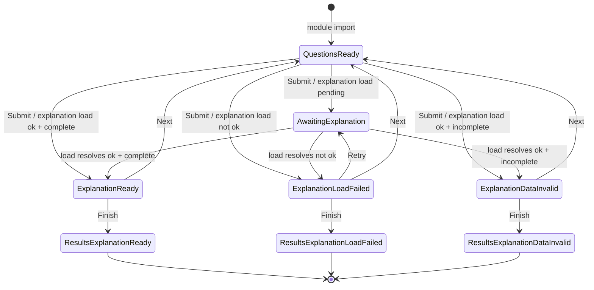

# Equivalence Quiz HLA



## Feedback panel variants

The feedback panel (below the question, hidden until first Submit)
shows one of these:

- **Loading indicator** — "Loading answers…" while the fetch is in
  flight.
- **Verdict + explanation** — "Correct." or "Incorrect." followed by
  per-option highlighting, the equivalence chain, and explanation
  prose for each correct answer. Shown when the bundle resolves and
  an entry exists for the question.
- **Load-failure callout** — "Couldn't load answers." (online) or
  "You appear to be offline. Reconnect and click Retry." (offline).
  Retry button mid-quiz; omitted on the results screen. Verdict not
  shown — without the bundle, the client can't grade.
- **Missing-entry callout** — "Answer data missing for this
  question." Not retryable; the same bundle returns the same
  missing entry.

## States

- **QuestionsReady** — question + four options on screen; Submit
  available; no feedback panel.
- **AwaitingExplanation** — options locked; loading indicator.
- **ExplanationReady** — verdict + explanation.
- **ExplanationLoadFailed** — load-failure callout (with Retry).
- **ExplanationDataInvalid** — missing-entry callout; Next available.
- **ResultsExplanationReady** — score + lists of correct/incorrect
  questions; expanding a past question shows verdict + explanation.
- **ResultsExplanationLoadFailed** — score + lists; expanded
  questions show load-failure callout (no Retry, terminal).
- **ResultsExplanationDataInvalid** — score + lists; expanded
  questions show missing-entry callout.

## `getCorrectAnswer` outcomes

```js
// ok + complete    → ExplanationReady
{ ok: true, correctAnswers, totalEquivalents, regionInfo,
  dirInfo, answerLinks, couplingDisclaimer }

// ok + incomplete  → ExplanationDataInvalid
{ ok: false, reason: 'missing-entry' }

// not ok           → ExplanationLoadFailed   (bundlePromise cleared)
{ ok: false, reason: 'fetch-failed' }
```

## Transitions

- **Submit** → `handleSubmit` awaits `getCorrectAnswer(q)`.
- **Next** → `recordCurrentAnswer()`, `qIdx++`, `renderQuestion()`.
- **Finish** → `recordCurrentAnswer()`, `renderResults()` (when
  `qIdx >= sessionSize`).
- **Retry** → re-invokes `getCorrectAnswer(q)`. `bundlePromise` is null
  (cleared on the prior `fetch-failed`), so this fires a fresh fetch.
