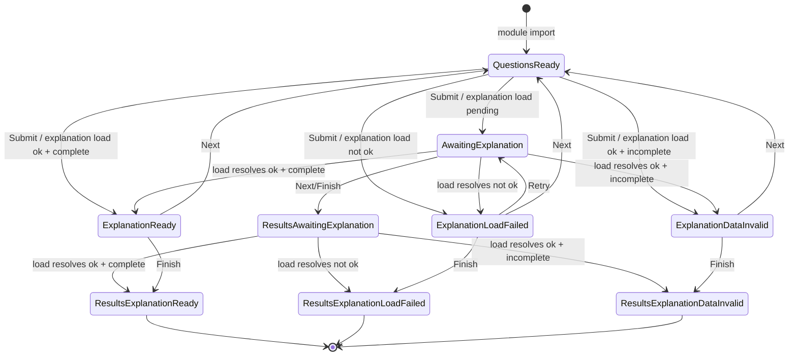

# Equivalence Quiz HLA

```mermaid
stateDiagram-v2
  [*] --> QuestionsReady: module import

  QuestionsReady --> AwaitingExplanation: Submit / explanation load pending
  QuestionsReady --> ExplanationReady: Submit / explanation load ok + complete
  QuestionsReady --> ExplanationLoadFailed: Submit / explanation load not ok
  QuestionsReady --> ExplanationDataInvalid: Submit / explanation load ok + incomplete

  AwaitingExplanation --> ExplanationReady: load resolves ok + complete
  AwaitingExplanation --> ExplanationLoadFailed: load resolves not ok
  AwaitingExplanation --> ExplanationDataInvalid: load resolves ok + incomplete
  AwaitingExplanation --> ResultsAwaitingExplanation: Next/Finish

  ResultsAwaitingExplanation --> ResultsExplanationReady: load resolves ok + complete
  ResultsAwaitingExplanation --> ResultsExplanationLoadFailed: load resolves not ok
  ResultsAwaitingExplanation --> ResultsExplanationDataInvalid: load resolves ok + incomplete

  ExplanationLoadFailed --> AwaitingExplanation: Retry
  ExplanationReady --> QuestionsReady: Next
  ExplanationLoadFailed --> QuestionsReady: Next
  ExplanationDataInvalid --> QuestionsReady: Next

  ExplanationReady --> ResultsExplanationReady: Finish
  ExplanationLoadFailed --> ResultsExplanationLoadFailed: Finish
  ExplanationDataInvalid --> ResultsExplanationDataInvalid: Finish

  ResultsExplanationReady --> [*]
  ResultsExplanationLoadFailed --> [*]
  ResultsExplanationDataInvalid --> [*]
```
