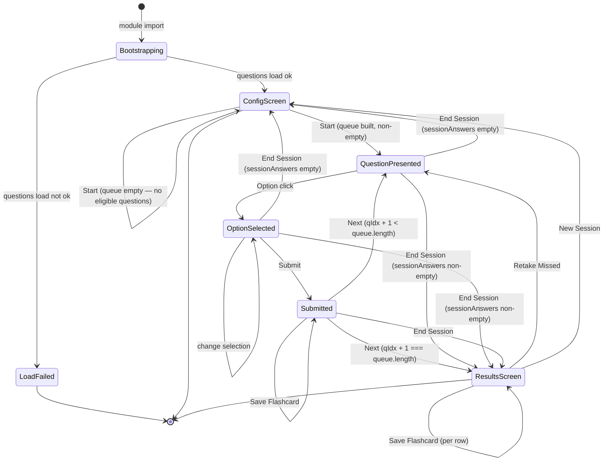

# Master Quiz HLA

`scripts/masterquiz.js` orchestrates the multiple-choice study quiz: domain
selection, queue generation, per-question grading, and the results screen.
Question bank, correct answer, and explanation prose all live inline in
`data/master-quiz.json` — there is no separate answer-key fetch (contrast
`prd/architecture/equivalence-quiz.md`, which lazy-loads answers). Progress
storage is delegated to `scripts/master-quiz-progress.js`.



## Screens

`#masterquiz-content` toggles between three screens via an ancestor class
(`screen-config` / `screen-quiz` / `screen-results`); the CSS cascade shows
the matching panel and hides the others.

- **ConfigScreen** (`screen-config`) — domain checkboxes, question count
  input, priority toggle, stats line, Start / Select-All / Deselect-All /
  Reset-Progress controls.
- **QuestionScreen** (`screen-quiz`) — progress bar, domain badge, stem,
  option buttons, Submit / Next, explanation slot, save-flashcard slot,
  optional equivalence-chain slot.
- **ResultsScreen** (`screen-results`) — score, missed list, correct list;
  each row expands to a detail panel with the per-option comparison,
  full explanation, and per-row save-flashcard button.

## Per-question states

- **QuestionPresented** — `selectedKey === null`, `submitted === false`.
  Options unlocked, Submit disabled, no explanation, no equivalence chain.
- **OptionSelected** — `selectedKey` set, `submitted === false`. One option
  has `.selected`; Submit enabled. Re-clicking another option moves
  `.selected`.
- **Submitted** — `submitted === true`. All options carry `.locked`; the
  correct option carries `.correct`; an incorrect pick carries
  `.incorrect`. `#mq-quiz` carries `answered-correct` or
  `answered-incorrect`. Submit hidden, Next visible (label "Next Question
  →" or "Finish Session" on the last item). Explanation callout shown.
  Save-flashcard button shown. Equivalence chain rendered if the stem,
  options, or explanation match `/\b(IP|IS|IsP|SI|AF|FA)\s+(ER|IR)\b/`.

## Equivalence-chain side panel

The chain (`#mq-equiv-wrap`) is a contextual aid, not part of the quiz
state machine. `detectEquivalence(q)` scans the question text for a
position token; on Submit, if any matched, the chain renders with the
matched positions highlighted plus an inverse line. The "Keep Pinned"
checkbox sets `equivPinned`; while pinned, the chain stays visible across
question transitions (`renderQuestion` only clears highlights;
`renderEquivChain` early-returns when no positions match and pinned is
true).

## Save Flashcard

Both the in-quiz Submitted panel and each ResultsScreen row expose a
"Save as Flashcard" button. Persistence goes through `saveUserFlashcard`,
which reads/writes `localStorage[userFlashcards]`. Outcomes:

```js
// success — new card added
{ ok: true, duplicate: false }

// success — id already present, no write performed
{ ok: true, duplicate: true }

// read failed (storage unavailable)
// parse failed (corrupt saved-card JSON)
// stringify failed (cyclic card data)
// write failed (quota / storage unavailable)
{ ok: false, message }
```

On `ok`, the button shows "✓ Saved" or "Already saved" and disables. On
`!ok`, an `.callout.error` is appended to the surrounding container
(`#mq-explanation` mid-quiz, the row detail on results) and the button
disables.

## Progress storage

`scripts/master-quiz-progress.js` owns the `masterQuiz_progress`
localStorage key. Per-question entry shape:

```js
{ correctStreak, totalCorrect, totalAttempts, lastSeen }
```

Public functions and return shapes:

```js
// Best-effort read; returns {} on parse or read failure.
tryLoad() → { [qId]: entry } | {}

// Background save; silently degrades if storage unavailable.
trySave(progress) → void

// User-initiated reset; caller catches and renders failure.
clearAll() → void   // may throw

// Update one entry and persist (background).
updateEntry(qId, correct) → void

// Aggregate stats for a question subset.
getStats(questions)
  → { attempted, missed, mastered, total }

// App-wide totals.
getSummary() → { attempted, mastered }

MASTERY_STREAK: 3
```

`buildQueue` consults `tryLoad` when priority mode is on, partitioning
eligible questions into missed (`correctStreak === 0` and seen), unseen,
and in-progress (mastered ones are excluded). The output is `count`
questions ordered missed → unseen → least-correct-first in-progress.

## Transitions

- **Start** → `handleStart` builds the queue and enters QuestionPresented;
  if the queue is empty (e.g., everything mastered), the stats slot shows
  "No questions available for selected domains." and the screen stays on
  ConfigScreen.
- **Option click** → `handleOptionSelect` sets `selectedKey` and enables
  Submit.
- **Submit** → `handleSubmit` grades against `q.answer`, persists via
  `updateEntry`, paints options, shows explanation, shows save-flashcard,
  triggers `renderEquivChain`.
- **Next** → `handleNext` advances `qIdx`; `renderQuestion` either renders
  the next question or falls through to `renderResults`.
- **End Session** → `handleEndSession` jumps to ResultsScreen when at
  least one question was submitted, otherwise back to ConfigScreen.
- **Retake Missed** → `handleRetakeMissed` rebuilds the queue from the
  current session's misses, resets state, and re-enters QuestionPresented.
- **New Session** → `handleNewSession` returns to ConfigScreen and
  refreshes the stats line.
- **Reset Progress** → `handleResetProgress` confirms, clears the storage
  key, and refreshes the stats line. On storage failure, the stats slot
  renders the failure inline.

## Listener topology

All listeners are attached once to `#masterquiz-content` in
`initListeners`:

- `click` — option-button delegation, results-row expand/collapse,
  results-row save-flashcard, then the ID-keyed `CLICK_DISPATCH` for
  Submit / Next / Start / End / Retake / New / Reset / Save / Select-All
  / Deselect-All.
- `change` — the pin-equivalence checkbox (re-rendered into
  `#mq-equiv-wrap` each Submit) and the domain-filter checkboxes (drive
  Start enablement and stats).
- `keydown` — suppress Enter on inputs/selects to avoid accidental form
  submission.

`innerHTML` re-renders inside the container (options, equivalence wrap,
explanation, results lists, result-detail panels) never drop listeners
because no listener is bound below the container — all interactions
resolve through delegation.
