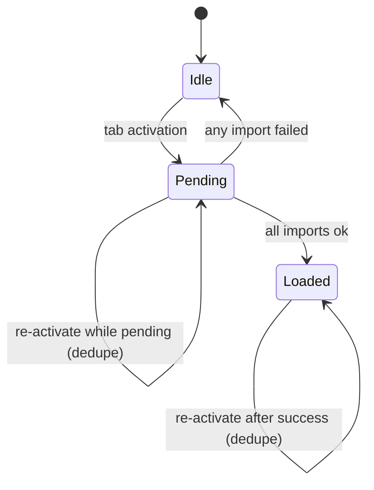

# Navigation-Tabs Contract

`scripts/navigation-tabs.js` imports a tab's module on first
activation. Import failures render inside the tab. A delayed skeleton
appears for loads over a threshold.

## Recovery

```js
const initialized = new Set();  // imports that resolved ok
const pending     = new Set();  // imports in flight
```

`lazyInit` adds to `pending` before starting an import and to
`initialized` only when every import in the entry resolved ok. A
failed import lands in neither set, so re-activating the tab re-enters
`lazyInit` and retries. The tab is the retry affordance.



Data-load failure (module imported ok but `loadJson` returned
`{ok: false}`) is handled by `loadAndRender` in `scripts/load.js`,
called per-module — not this contract.

## Failed import doesn't tank siblings

A broken module does not blank the tab. The importer wraps `import()`
so it always resolves to a result POJO:

```js
function importModule(path) {
  return import(path).then(
    ()    => ({ok: true,  path}),
    cause => ({ok: false, path, cause})
  );
}

Promise.all(paths.map(importModule)).then((results) => {
  // results is always populated, including failed paths
});
```

`Promise.all` is sufficient — no `Promise.allSettled` — because each
thenable always resolves. Partial failure is
`results.filter(r => !r.ok)`, not a try/catch dance around `await`.

Successful imports' module-top setup ran before `Promise.all`
settled, so their UI is in the container; only the failed paths get
inline errors. The one multi-path entry today is the concept-map
subtab; future entries should be single paths.

## Skeleton

```js
const SHOW_SKELETON_AFTER_MS = 250;
```

Loads under threshold show no skeleton. Loads over threshold show
exactly until imports resolve. A brief-flash window exists when an
import finishes shortly after the timer fires; padding short loads to
a minimum skeleton display would mask real latency, so the flash
stands.
