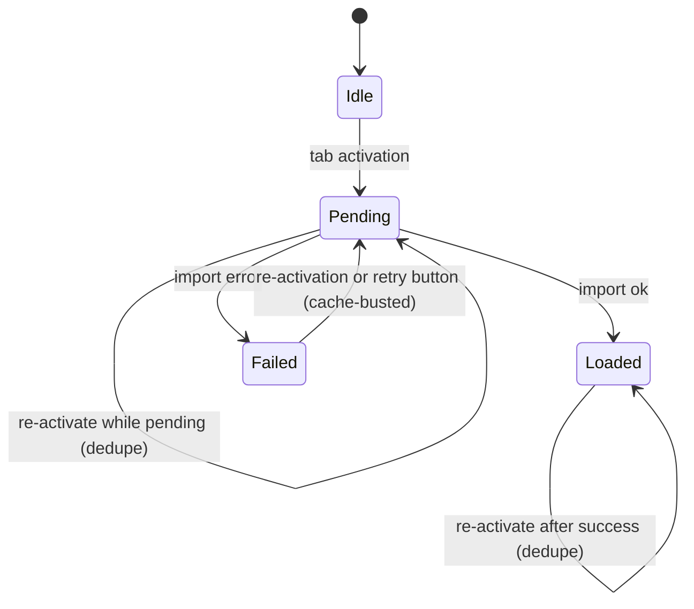

# Navigation-Tabs Contract

`scripts/navigation-tabs.js` maps the URL hash to a tab and imports that tab's module the first time the tab is activated. The hash is `#tab` or `#tab/subtab`.

## Recovery

```js
const initialized = new Set();  // imports that resolved ok
const pending     = new Set();  // imports in flight
const failed      = new Set();  // imports that resolved with error
```

`lazyInit` adds the contentId to `pending` before starting an import. On resolution it removes from `pending` and lands in exactly one of `initialized` (ok) or `failed` (error). On failure, `handleImportError` renders a callout whose retry button calls `lazyInit` again. Re-clicking the tab calls `lazyInit` too. The tab and the retry button share one lifecycle: while the import is in flight, the tab dims and the retry button is locked by CSS cascade — see "Idempotent retry path" below.

A dynamic `import()` caches its outcome — including failure — in the module map, so re-importing the same path returns the cached error without re-fetching. To force a real retry, `lazyInit` appends a cache-busting query suffix when `failed.has(contentId)`:

```js
const path = failed.has(contentId) ? entry + '?r=' + Date.now() : entry;
failed.delete(contentId);
```

`handleNavClick` short-circuits same-hash clicks. Assigning the same value to `location.hash` fires no `hashchange` event, so re-clicking the failed tab would otherwise be a no-op. When the clicked link's hash equals `location.hash`, `handleNavClick` calls `applyHash()` directly.



Data-load failure (module imported ok but `loadJson` returned `{ok: false}`) is handled by `attemptLoad` in `scripts/error-ui.js`, called per-module — not this contract.

## Idempotent retry path

The tab (or subtab) and the retry button are two actuators for the same state transition: `Failed → Pending` for a given contentId. The state machine cares about the contentId, not which actuator triggered it. Both routes land in the same `lazyInit(contentId, link)` call.

`.loading` is the in-flight signal. `lazyInit` writes it to two surfaces:

- The actuator (`link`) — `.nav-tab.loading` / `.subtab.loading` dim the tab and set `cursor: wait`.
- The container — `.content.loading` is the ancestor signal for any retry buttons inside. `css/layout.css` declares `.content.loading .callout-retry { pointer-events: none; opacity: 0.5; }`, so a callout still on screen during retry has its button dimmed and disabled by cascade — no JavaScript toggles `button.disabled` or rewrites the label.

Spam-clicks have two independent guards:

1. **JS-side**, `lazyInit` returns early when `pending.has(contentId)`.
2. **CSS-side**, `.content.loading .callout-retry` makes the button uninteractive while `.loading` is set.

The renderer is a separate concern from the loader. `load.js` diagnoses failures and delegates rendering through a callback. `handleImportError(result, {render, onRetry})` translates `result.cause` into a user-readable message, then invokes `render(message, onRetry)`. The render delegate lives in `error-ui.js` as `renderError`, which constructs the callout and retry button. The loader names no DOM element; the renderer is swappable without touching `load.js`.

The retry button's `click` handler:

```js
onRetry: () => lazyInit(contentId, link)
```

Clicking it re-enters `lazyInit` for the same contentId — the `Failed → Pending` transition (cache-busted), the same call re-activating the tab makes. Callout lifecycle belongs to the state machine: `lazyInit` calls `clearErrors(container)` after the import resolves, before re-rendering content or showing a fresh callout.

## Single path per entry

`LAZY_INIT` maps each contentId to one module path. A module that needs another — a sibling subtab module on the same tab, or a cross-feature read like home's master-quiz progress — statically imports it at module top. ES module static imports propagate failure: if the dependency fails to fetch, parse, or evaluate, the importer's body does not execute, so a partial-state "half-wired UI plus an error callout" is impossible by construction.

## Re-activation and self-driven redraw

`lazyInit` runs a module exactly once per contentId — it returns early when `initialized.has(contentId)`. navigation-tabs.js never re-invokes a module on re-activation; `Loaded → Loaded` in the diagram is a dedupe no-op. Whatever a module wires up at init runs once for the page's life — re-activating its tab cannot stack listeners. The corollary: a module that must react each time its section is shown is not re-run, so it owns a long-lived subscription instead. navigation-tabs.js does not call back into modules.

For example, module `home.js` creates an IntersectionObserver on `#home-content` and runs `renderMasterQuizProgress` each time it's displayed.

## Skeleton

```js
const SHOW_SKELETON_AFTER_MS = 250;
```

A load that resolves within 250 ms shows no skeleton; a longer one shows the skeleton from 250 ms until the import resolves. A load resolving just after 250 ms flashes the skeleton briefly before removing it. The timer has no minimum on-screen duration — adding one would hold the skeleton past content-ready and make fast loads look slow.
