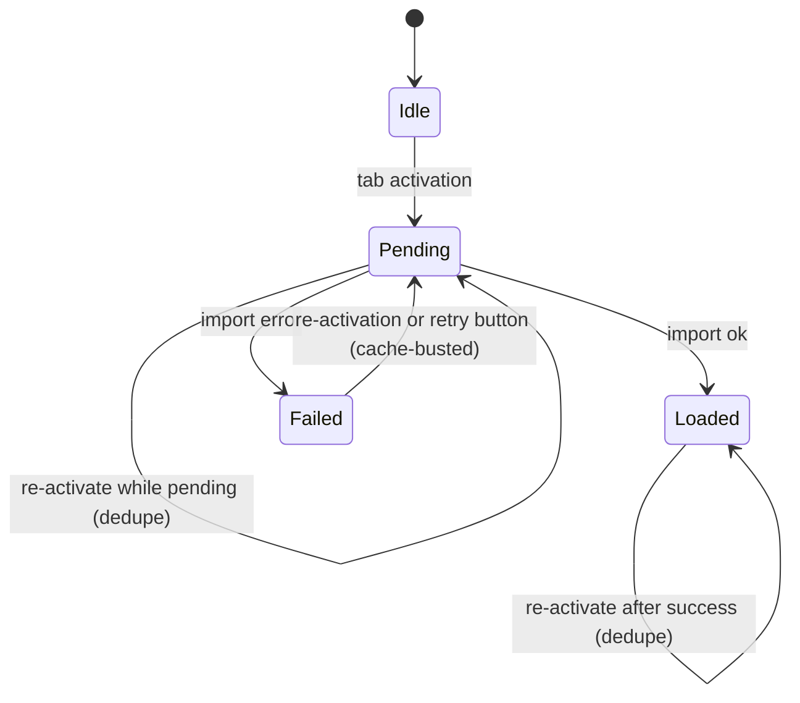

# Navigation-Tabs Contract

`scripts/navigation-tabs.js` imports each tab's module the first time
the tab is activated. Import failures render inside the tab with a
retry button; re-activating the tab also retries. A delayed skeleton
appears for loads over a threshold, and the clicked tab itself shows
a `.loading` style for the duration of the import.

## Recovery

```js
const initialized = new Set();  // imports that resolved ok
const pending     = new Set();  // imports in flight
const failed      = new Set();  // imports that resolved with error
```

`lazyInit` adds the contentId to `pending` before starting an import.
On resolution it removes from `pending` and lands in exactly one of
`initialized` (ok) or `failed` (error). On failure, `handleImportError`
renders a callout whose retry button calls `lazyInit` again.
Re-clicking the tab calls `lazyInit` too. The tab and the retry
button share one lifecycle: while the import is in flight, the tab
dims and the retry button is locked by CSS cascade — see "Idempotent
retry path" below.

A dynamic `import()` caches its outcome — including failure — in the
module map, so re-importing the same path returns the cached error
without re-fetching. To force a real retry, `lazyInit` appends a
cache-busting query suffix when `failed.has(contentId)`:

```js
const path = failed.has(contentId) ? entry + '?r=' + Date.now() : entry;
failed.delete(contentId);
```

`handleNavClick` short-circuits same-hash clicks. Assigning the
same value to `location.hash` fires no `hashchange` event, so
re-clicking the failed tab would otherwise be a no-op. When the
clicked link's hash equals `location.hash`, `handleNavClick` calls
`applyHash()` directly.



Data-load failure (module imported ok but `loadJson` returned
`{ok: false}`) is handled by `attemptLoad` in `scripts/error-ui.js`,
called per-module — not this contract.

## Idempotent retry path

The tab (or subtab) and the retry button are two actuators for the
same state transition: `Failed → Pending` for a given contentId. The
state machine cares about the contentId, not which actuator triggered
it. Both routes land in the same `lazyInit(contentId, link)` call.

`.loading` is the in-flight signal. `lazyInit` writes it to two
surfaces:

- The actuator (`link`) — `.nav-tab.loading` / `.subtab.loading` dim
  the tab and set `cursor: wait` so the user sees their click landed.
- The container — `.content.loading` is the ancestor signal for any
  retry buttons inside. `css/layout.css` declares
  `.content.loading .callout-retry { pointer-events: none; opacity: 0.5; }`,
  so a callout still on screen during retry has its button dimmed and
  disabled by cascade — no JavaScript toggles `button.disabled` or
  rewrites the label.

Spam-clicks have two independent guards:

1. **JS-side**, `lazyInit` returns early when `pending.has(contentId)`.
2. **CSS-side**, `.content.loading .callout-retry` makes the button
   uninteractive while `.loading` is set.

The renderer is a separate concern from the loader. `load.js`
diagnoses failures and delegates rendering through a callback.
`handleImportError(result, {render, onRetry})` translates
`result.cause` into a user-readable message, then invokes
`render(message, onRetry)`. The render delegate lives in
`error-ui.js` as `renderError`, which constructs the callout and
retry button. The loader names no DOM element; swapping the renderer
for an anchor, a web component, or a console writer leaves `load.js`
untouched.

The retry button itself is presentation-only: its `click` handler is
exactly `onRetry`. It does not manipulate its own state or remove the
callout. Callout lifecycle belongs to the state machine: `lazyInit`
clears `.callout.error` from the container after the import resolves
(before either re-rendering content or showing a fresh callout), and
`attemptLoad` (in `error-ui.js`) does the symmetric thing for
data-load retries by tracking the prior callout in closure and
removing it on each new attempt.

## Single path per entry

`LAZY_INIT` maps each contentId to one module path. When two modules
share a tab, the relationship lives in the modules: the entry-point
module statically imports the sibling at module-top. ES module static
imports propagate failure — if the sibling fails to fetch, parse, or
evaluate, the importer's body does not execute — so partial-state
"half-wired UI plus an error callout" is impossible by construction.

## Skeleton

```js
const SHOW_SKELETON_AFTER_MS = 250;
```

Loads under threshold show no skeleton. Loads over threshold show
exactly until imports resolve. A brief-flash window exists when an
import finishes shortly after the timer fires; padding short loads to
a minimum skeleton display would mask real latency, so the flash
stands.
