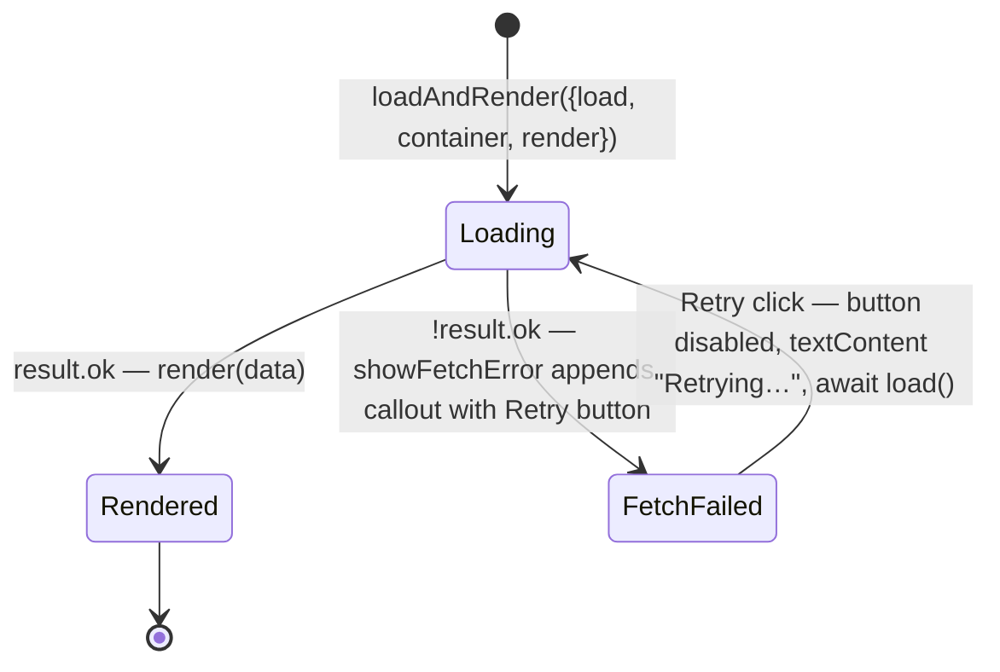

# Navigation-Tabs Contract

`scripts/navigation-tabs.js` is the orchestrator for tab/subtab activation, lazy module loading, and loading-state UI. This doc is the canonical contract every lazy-loaded module follows. Per-tab HLAs (`prd/architecture/*`) reference this doc rather than restating the contract.

## What navigation-tabs owns

- Tab and subtab activation: hash routing, `.activeTab` class management, scroll affordance.
- Lazy import dispatch: imports the module(s) for a content id on first activation.
- Skeleton loading UI: delayed-show placeholder shown only when load takes longer than a threshold.
- Import-error rendering: when a module's `import()` rejects (file not found, syntax error, etc.), navigation-tabs renders the error inside the content container.

## What navigation-tabs does *not* own

- Module readiness signaling (no awaitable contract beyond import resolution).
- Module-internal setup beyond what `import()` runs. Modules perform setup at module top.
- Module activation events (no `subtab-shown` dispatch).
- Data loading or data-error rendering (each module owns its data; data errors render inside the module's container).
- Subsequent activations beyond the first (the module cache handles repeat imports; modules use `ResizeObserver` for layout-redraw on revisit).

## LAZY_INIT entries

The entity relationship: **route ↔ container id ↔ module path**, one Shared Key per subtab, 1:1:1 (see `prd/architecture/layering.md`). LAZY_INIT is the binding between container id and module path in that triple.

```js
const LAZY_INIT = {
  'flashcards-content':           './flashcards.js',
  'patterns-cheat-sheet-content': './patterns-cheat-sheet.js',
  // ...
};
```

Each key is a content-element id. Each value is a module path. One container, one module.

The key shape varies with the surrounding architecture:
- **Section-level entries** (`'<tab>-content'`, e.g. `'flashcards-content'`) — for tabs with no subtab row. Currently: Nomenclature, Flashcards, Equivalence, Master Quiz.
- **Subtab-level entries** (`'<tab>-<subtab>-content'`, e.g. `'patterns-cheat-sheet-content'`) — for tabs whose orchestrator dissolved. Currently: Anatomy, Patterns, Diagnose subtabs.

### ER violation: `patterns-concept-map-content`

One current entry breaks the 1:1 cardinality: the concept-map subtab loads two modules, and LAZY_INIT carries an array value to express it.

```js
'patterns-concept-map-content': ['./patterns-concept-map.js', './patterns-symptom-quiz.js'],
```

`lazyInit` accommodates this with a polymorphic value shape — it accepts `string | string[]` and `Promise.all`s the imports — but the polymorphism is the symptom of the underlying violation, not a designed-in feature. The concept-map subtab hosts two distinct features (`#concept-map-svg` and `#symptom-quiz-wrap`) inside a single container, so the Shared Key no longer points to one module.

Three ways to restore 1:1 (any is acceptable; choice belongs in the Patterns HLA):
1. **Split the subtab** — give symptom-quiz its own subtab and its own content id. Each subtab gets one module.
2. **Merge the modules** — fold `patterns-symptom-quiz.js` into `patterns-concept-map.js` (or vice versa) since they share a container.
3. **Introduce a subtab orchestrator** — one module per content id that internally imports both features. Restores 1:1 in LAZY_INIT at the cost of reintroducing a dissolved-orchestrator pattern.

Until one of those lands, the polymorphic value shape stays as a documented accommodation. New entries must be single strings.

The decision of "tab module exists, point at it" vs "tab module dissolves, point at per-subtab files" is per-tab and lives in the tab's HLA. Navigation-tabs just dispatches based on what LAZY_INIT says.

## Lazy import flow

`lazyInit(contentId)` is called from `activateTab` and `activateSubtab` on every tab/subtab activation. State is tracked across two Sets — `initialized` (imports that resolved successfully) and `pending` (imports in flight) — so a failed import leaves the tab in neither set, letting the next activation retry it.

1. **Dedupe.** Return if `contentId` is in `initialized` (already loaded) or `pending` (in flight).
2. **Resolve.** Look up the `LAZY_INIT` entry; return if absent. Resolve the container by id; return if absent.
3. **Mark pending.** Add `contentId` to `pending`. Remove any stale `.callout.error` nodes from a prior failed attempt.
4. **Start skeleton timer.** `setTimeout(showSkeleton, SHOW_SKELETON_AFTER_MS)`.
5. **Import each path in parallel** via a small `importModule(path)` helper that resolves to a plain result object — never rejects. `Promise.all` collects every outcome.
6. **After all resolve:** cancel skeleton timer; clear skeleton; remove `contentId` from `pending`. If no failures, add to `initialized`. Otherwise, render an import-error per failed path; `initialized` stays unset so the next activation retries.

```js
const SHOW_SKELETON_AFTER_MS = 250;

function importModule(path) {
  return import(path).then(
    ()    => ({ok: true,  path}),
    cause => ({ok: false, path, cause})
  );
}

function lazyInit(contentId) {
  if (initialized.has(contentId) || pending.has(contentId)) return;

  const entry = LAZY_INIT[contentId];
  if (!entry) return;

  const container = document.getElementById(contentId);
  if (!container) return;

  pending.add(contentId);
  container.querySelectorAll('.callout.error').forEach((el) => el.remove());

  const paths = Array.isArray(entry) ? entry : [entry];
  const skeletonTimer = setTimeout(
    () => showTabLoading(container),
    SHOW_SKELETON_AFTER_MS
  );

  Promise.all(paths.map(importModule)).then((results) => {
    clearTimeout(skeletonTimer);
    clearTabLoading(container);
    pending.delete(contentId);

    const failures = results.filter((r) => !r.ok);
    if (failures.length === 0) {
      initialized.add(contentId);
      return;
    }

    failures.forEach((r) => showImportError(container, r.path, r.cause));
  });
}
```



```mermaid
stateDiagram-v2
  [*] --> Idle: tab declared in LAZY_INIT

  Idle --> Pending: tab activation (lazyInit enters)
  Pending --> Loaded: imports resolve, no failures — initialized.add(contentId)
  Pending --> Idle: imports resolve, any failure — showImportError; contentId stays out of initialized

  Pending --> Pending: re-activation while pending (dedupe via pending.has)
  Loaded --> Loaded: re-activation after success (dedupe via initialized.has — module cached in realm map)
```

`importModule` resolves with `{ok, path}` on success or `{ok: false, path, cause}` on failure — a plain result object, no mutation of built-in `Error` instances and no custom error subclass. Each call always resolves, so `Promise.all` is sufficient (no `Promise.allSettled` needed). Successful imports' module-top side effects already ran during the import attempt, so their content is in the container regardless of sibling failures.

For single-path entries: one result, render its error if it failed.

For multi-path entries (e.g., `patterns-concept-map-content` loading both concept-map and symptom-quiz): one path failing does not bail out the others. The user sees whichever modules rendered successfully *and* an import-error message for each that failed, identifying the specific file via `r.path`.

`clearTabLoading` is idempotent (it removes `.tab-loading` if present, no-ops if not), so canceling the timer + always calling `clearTabLoading` is safe whether or not the skeleton ever became visible.

## Skeleton timing

- **Threshold (`SHOW_SKELETON_AFTER_MS`):** 250ms. Loads under threshold show no skeleton at all. Loads over threshold show the skeleton until they complete.
- **No minimum display.** Skeleton hides exactly when the load completes. A brief flash zone exists (load resolves shortly after the timer fires) but is preferable to padding load times. If brief flashes turn out to be perceptible in practice, raise the threshold; do not add minimum-display padding.
- **Polish (later):** a CSS opacity transition on `.tab-loading` would soften the show/hide; not required for the contract.

The skeleton itself is a generic placeholder (one heading skeleton + two line skeletons). It does not match per-feature layout — it only signals "loading is taking longer than expected." A skeleton's *presence* is the information; its content is incidental.

## Module contract

A lazy-loaded module:

- **Performs setup at module top** as side effects on import. Module-top runs once per realm via the ES module cache. Modules may export anything they need internally; navigation-tabs does not call any function on them.
- **Handles its own data load.** Uses `loadAndRender({load, container, render})` from `scripts/load.js`. The helper calls the loader (typically `() => loadJson(path)`, returning a POJO `{ok, data, path, cause}`), invokes `render(data)` on success, and on failure renders an inline error callout with a Retry button that re-runs the loader. Render bugs propagate as ordinary errors past `render(...)`.
- **For layout-sensitive features** (those needing redraw when the container becomes visible or resizes): observes its own container with `ResizeObserver`.
- **Pre-data controls** (interactive elements present in source HTML before data loads) are either `disabled` until render or guard explicitly on data-ready in their handlers. Generated controls (those that don't exist before render) need no guard — `closest()` returns null and handlers return early.

Modules **MUST NOT**:

- Depend on navigation-tabs calling any function on them (the import is the only signal).
- Add or remove the skeleton themselves — that is navigation's responsibility.

## Retry semantics

Two distinct failure modes, two distinct recovery paths — both without page reload.

- **Import failure** (a `LAZY_INIT` path's `import()` rejects — file not found, syntax error, network drop). `lazyInit` leaves `initialized` unset on failure, so the next tab activation re-enters and retries the import. The visible recovery affordance is the tab itself: re-click it. Stale `.callout.error` callouts are removed on re-entry before the new attempt runs.
- **Data-load failure** (the module imported successfully but its `loadJson` call returned `{ok: false}` — bad path, HTTP error, parse error). The module's `loadAndRender` call renders an inline Retry button next to the error callout; clicking it disables the button, shows "Retrying…", and re-runs the loader. `initialized` is already set at this point — the tab itself is loaded; only the data fetch is being retried.



The two recovery paths are complementary, not alternatives. Import failure is handled at the navigation-tabs layer (`pending` vs `initialized` Set split, gate-on-success). Data-load failure is handled per-module via the shared `loadAndRender` helper. Successful imports + successful data loads are cached for the realm; re-activations after success are dedupe'd by `initialized.has`.

## ResizeObserver as the layout-redraw signal

Layout-sensitive modules (anatomize, aic-chain) observe their own container with `ResizeObserver`. One signal covers both cases:

- **First display:** container goes from 0×0 (hidden via `display: none`) to non-zero. Observer fires — initial draw.
- **Subsequent resize:** window or panel resize. Observer fires — redraw.

The callback must be safe to re-run; existing draw functions are (e.g., `drawArrows` skips structures that already have an arrow drawn).

Activation in this codebase uses CSS `display: none ↔ block` for subtab visibility, so dimensions change on activation and `ResizeObserver` fires reliably. If activation ever switches to `visibility` or `opacity` toggling, dimensions wouldn't change and `ResizeObserver` wouldn't fire — that's a contract dependency worth knowing.

## Import-error rendering

`showImportError(container, pathSpec, moduleError)` (existing helper in `scripts/load.js`) renders an import error inside the container. Used by navigation-tabs's `.catch` on the import promise.

`pathSpec` is a string — for multi-path entries, the paths joined by `', '`. Sufficient for the developer to identify which files were involved; the user-facing message says "couldn't load this section" and the path is diagnostic.

## What this doc does *not* cover

- `scripts/load.js` and the result POJO `{ok, data, path, cause}` — see `prd/architecture/layering.md` and the diagnose migration plan.
- ADT class members, Decorator Factory pool — see `prd/architecture/layering.md`.
- Per-tab module structure decisions (when does a tab module exist?) — see per-tab HLAs.
- App-level error UI styling (`showImportError`, `showFetchError` rendering) — those helpers are app-level and live in `scripts/load.js`.
